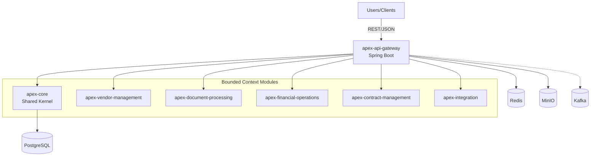
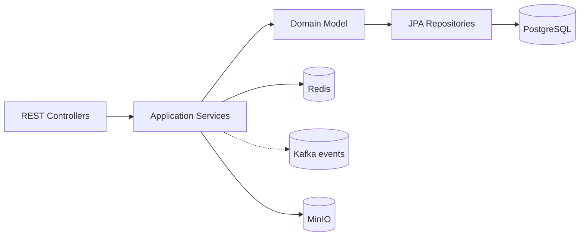
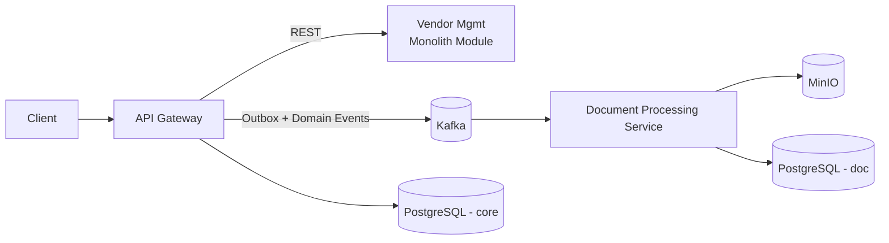

# Apex IDP Backend Architecture Blueprint

Generated: 2025-08-18

## Summary
A modular monolith built on Spring Boot 3.2 / Java 17 with DDD-style bounded contexts packaged as Maven modules and aggregated into a single runtime: `apex-api-gateway`. Infrastructure includes PostgreSQL, Redis, MinIO, and Kafka.

- Architecture pattern: Modular Monolith (Layered, DDD Bounded Contexts), evolvable to Microservices
- Modules: `apex-core`, `apex-document-processing`, `apex-vendor-management`, `apex-financial-operations`, `apex-contract-management`, `apex-integration`, runtime `apex-api-gateway`
- Cross-cutting: Spring Security (JWT), Validation, Actuator, OpenAPI, Flyway, WebSocket, Kafka readiness
- Data: PostgreSQL (JPA/Flyway), Redis (cache), MinIO (objects), Kafka (events)

## Architecture Overview
- `apex-api-gateway` composes all domain modules as dependencies, exposes REST APIs, and serves Swagger UI and Actuator.
- `apex-core` provides shared kernel: common config, security/JWT, utilities, OpenAPI, Flyway, Kafka client.
- Bounded contexts own their domain logic with controllers → services → repositories → DB and adapters to external systems.

## Architecture Diagrams

### Modules / Component View

### Layered View (per module)

## Core Components
- API Gateway (`apex-api-gateway`): REST endpoints, OpenAPI, Actuator, WebSocket; imports all contexts.
- Shared Kernel (`apex-core`): security (JWT via JJWT), validation, global error handling, OpenAPI, Flyway migrations, Kafka client, common utilities.
- Bounded Contexts:
  - Document Processing: Apache Tika for MIME/parse, MinIO storage, processing orchestration.
  - Vendor Management: vendor lifecycle and validation.
  - Financial Operations: finance-related modeling and services.
  - Contract Management: contract lifecycle and access control.
  - Integration: ERP/external connectivity via Spring Integration and WebFlux.

## Layers and Dependencies
- Each context follows: controllers (API) → services (application) → domain (entities/aggregates/value objects) → repositories (JPA) → PostgreSQL.
- Infrastructure adapters: Redis cache, MinIO storage, Kafka producer/consumer, HTTP clients.
- `apex-api-gateway` depends on all context modules; contexts depend on `apex-core` only; avoid cross-context direct dependencies.

## Data Architecture
- PostgreSQL as the system of record with Spring Data JPA; Flyway migrations version schema.
- MinIO for object storage (documents, images, binaries).
- Redis for caching and ephemeral data.
- Kafka for asynchronous processing and integration events.
- Recommend outbox pattern when publishing domain events with DB writes.

## Cross-Cutting Concerns
- Security: Spring Security + JWT (JJWT). Use method/URL-based authorization; secure Actuator in non-dev.
- Validation: Jakarta Bean Validation on DTOs and domain invariants where applicable.
- Observability: Actuator health/info/metrics; container healthchecks wired to `/api/actuator/health`.
- API Contract: springdoc OpenAPI; annotate controllers/DTOs for schema quality.
- Errors: centralized exception handling (ControllerAdvice) and problem-details style responses.

## Service Communication
- In-process calls among modules (modular monolith) for low latency.
- External: WebFlux clients and Spring Integration flows; use circuit breakers/timeouts/retries where applicable.
- Messaging: Kafka topics for decoupled asynchronous workflows.

## Technology-Specific Patterns
- Spring MVC for synchronous HTTP; WebFlux for non-blocking outbound I/O.
- Spring Data JPA repositories per aggregate; `@Transactional` on service boundaries.
- Spring Integration channels/adapters for ERP ingestion and delivery.
- OpenAPI-first documentation; consider code generation for clients as needed.

## Implementation Patterns
- Suggested package layout per context:
  - api: controllers, DTOs, exception advice
  - application: services, orchestrations, transactions
  - domain: aggregates, entities, value objects, domain services
  - infrastructure: JPA repositories, Redis/MinIO/Kafka/HTTP adapters
- Mapping: introduce MapStruct (parent defines version) for DTO ↔ domain mappings.

## Testing Architecture
- Unit tests: services, validators, mappers.
- Slice: `@WebMvcTest`, `@DataJpaTest`.
- Integration: Spring Boot tests + Testcontainers (PostgreSQL, Kafka) for persistence and messaging.
- Security: `spring-security-test`.
- Contract: minimal smoke tests for OpenAPI and live endpoints.

## Deployment Architecture
- Docker Compose services: Postgres 15, Redis 7, Zookeeper+Kafka, MinIO.
- Runtime: `apex-api-gateway` container with `SPRING_PROFILES_ACTIVE=docker`, exposes 8080 (API), 5005 (debug).
- Healthchecks:
  - DB: `pg_isready`
  - Redis: `redis-cli incr ping`
  - MinIO: `/minio/health/live`
  - API: `/api/actuator/health`

## Extension and Evolution
- Extract Microservice: choose a context, create independent Spring Boot app, expose HTTP API, move schema ownership, replace in-process calls with HTTP/Kafka. Use outbox + CDC for consistency.
- Add Context: add new Maven module, depend on `apex-core`, register controllers/services/repos, add Flyway migrations, wire into gateway dependencies.

## Governance
- Enforce dependency rules (contexts → core; gateway → contexts only).
- Coding standards (Java 17, Spring Boot 3, null and validation discipline).
- Security review for endpoints and sensitive configs; move secrets to vaults.
- Documentation: keep this blueprint and per-context READMEs updated; record ADRs for significant decisions.

## Next Steps
- Add module-level READMEs documenting public APIs and domain models.
- Introduce MapStruct for mappings and enforce DTO/domain separation.
- Add Flyway baseline per context schema if not already present.
- Define Kafka topics and event shapes where async flows are required.
- Add integration tests via Testcontainers for critical flows (doc ingest, vendor CRUD, etc.).

## Future-state: Target Microservices Extraction (Example)
The diagram below sketches extracting Document Processing as an independent service using an outbox pattern and Kafka for domain/integration events.

### Steps to Extract a Context
- Carve out API boundary and publish OpenAPI for the new service.
- Move its schema/migrations to service repo; ensure ownership isolation.
- Introduce outbox in monolith for events; consume in service, reply via event or REST callback.
- Replace in-process calls with HTTP/Kafka; add resiliency (timeouts, retries, circuit breakers).

### Module Docs
- See per-module READMEs for details:
  - [apex-core README](../apex-core/README.md)
  - [apex-document-processing README](../apex-document-processing/README.md)
  - [apex-vendor-management README](../apex-vendor-management/README.md)
  - [apex-financial-operations README](../apex-financial-operations/README.md)
  - [apex-contract-management README](../apex-contract-management/README.md)
  - [apex-integration README](../apex-integration/README.md)
