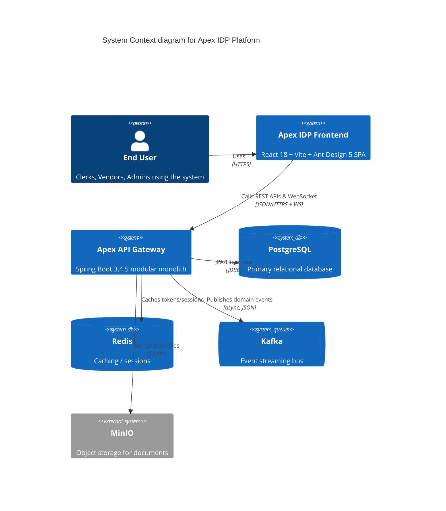
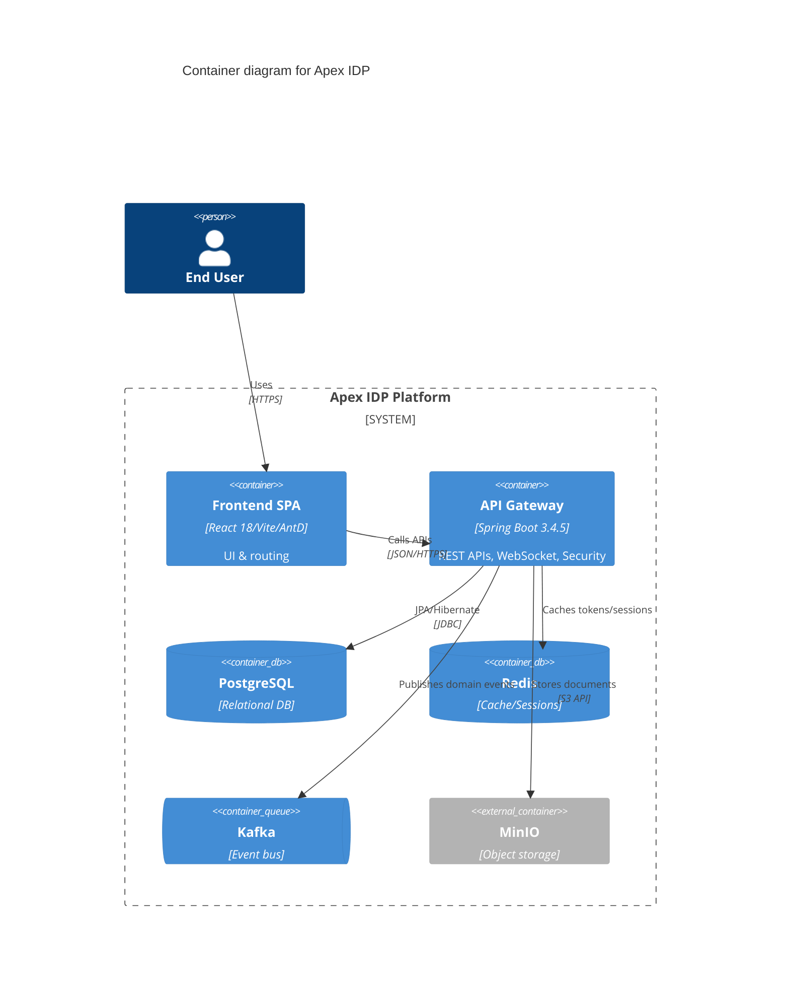
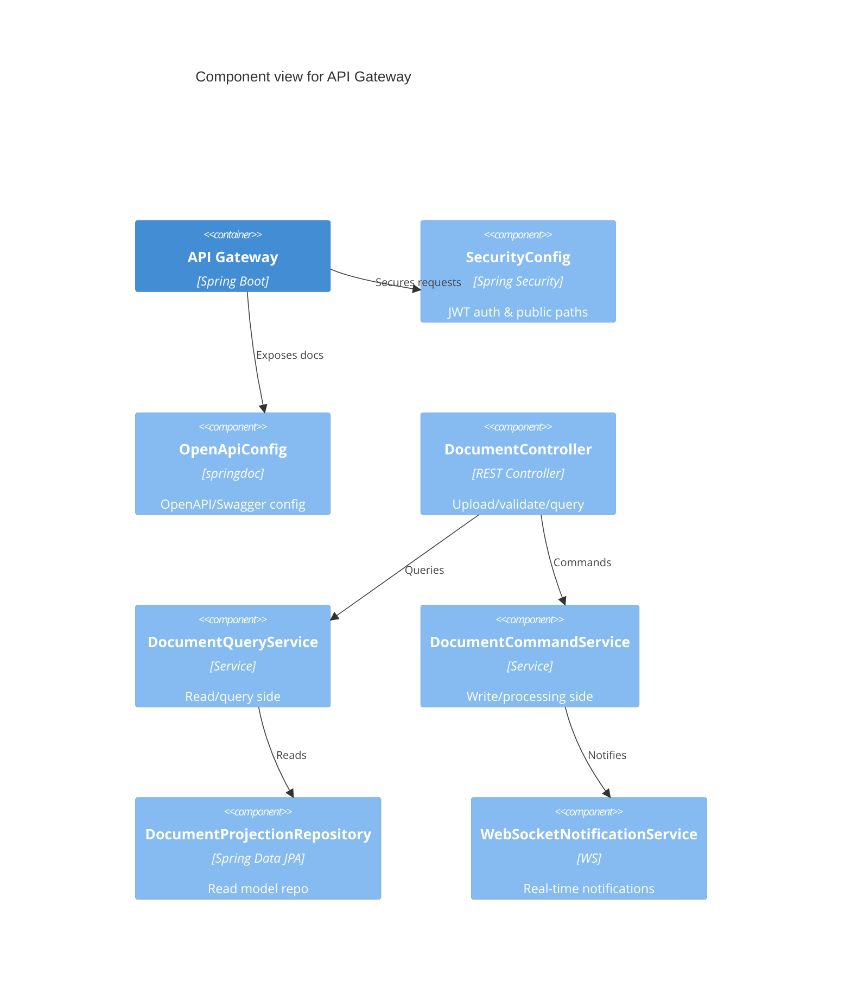
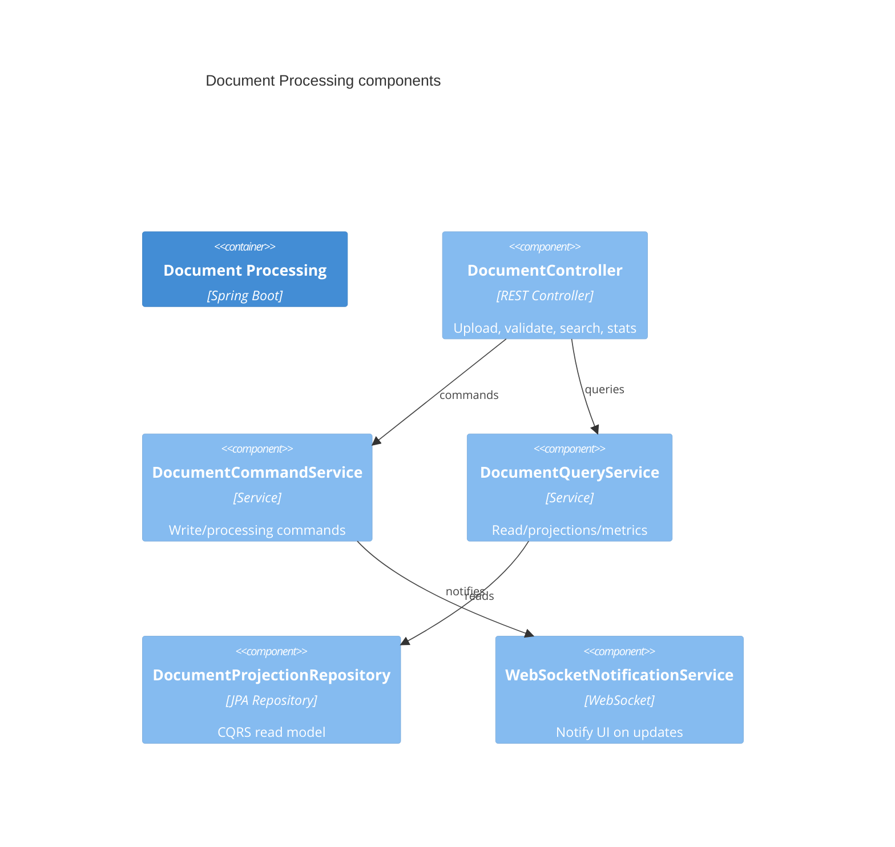
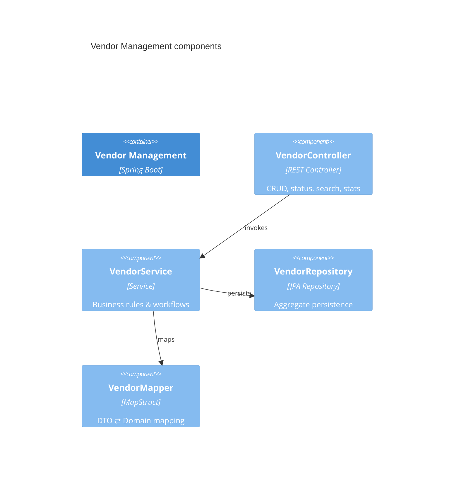
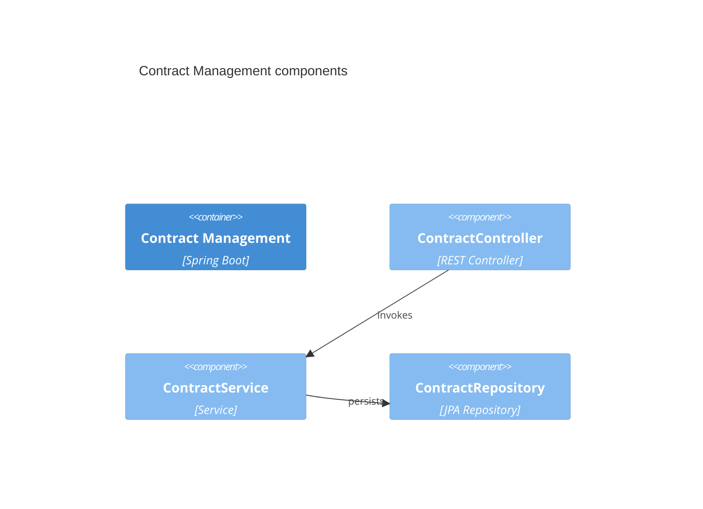
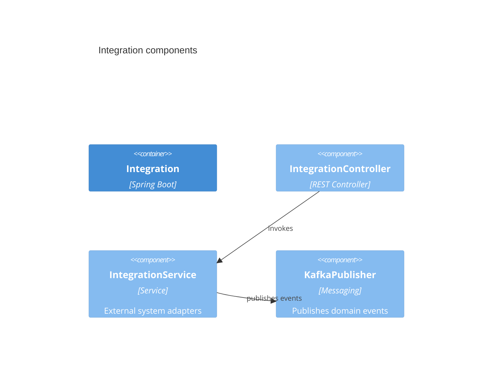
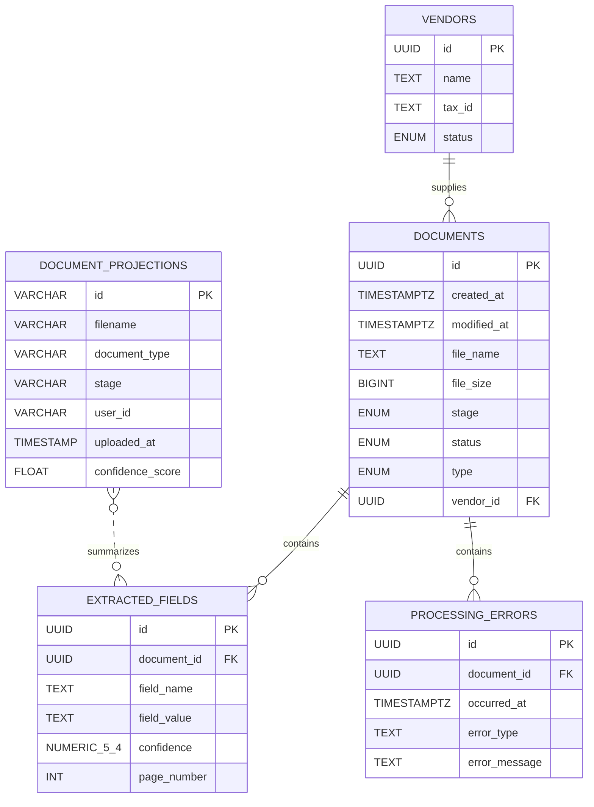

# Project Architecture Blueprint

Generated: 2025-08-19

## Overview
Apex IDP is a modular monolith (DDD-style) on Spring Boot 3.4.5 with a React 18/Vite frontend. Backend modules include core, vendor-management, document-processing, financial-operations, contract-management, integration, and the API gateway. Infrastructure includes PostgreSQL, Redis, Kafka, and MinIO; H2 and in-memory mocks are used in dev.

## System Context (C4)


## Containers (C4)


## Components (C4) – API Gateway focus


## Module components (C4) — by bounded context

### Document Processing


### Vendor Management


### Financial Operations


### Contract Management


### Integration


## Data model highlights
- DocumentProjection: id, filename, documentType, stage, userId, uploadedAt, lastModified, extractedFields, confidenceScore, storagePath, isValid, validationErrors.
- Derived queries: `countByUploadedAtAfter(LocalDateTime)` for daily metrics.
- Document (write model): created_at, modified_at; related entities like ExtractedField, ProcessingError.

### ER overview


## Representative code examples

### DocumentController (REST)
```java
// ...excerpt from apex-document-processing/src/main/java/com/apex/document/api/DocumentController.java
@PostMapping(value = "/upload", consumes = MediaType.MULTIPART_FORM_DATA_VALUE)
@PreAuthorize("hasAnyRole('AP_CLERK', 'VENDOR')")
public ApiResponse<DocumentUploadResponse> uploadDocument(
        @RequestParam("file") MultipartFile file,
        @RequestParam(value = "vendorId", required = false) UUID vendorId) {
    UUID documentId = commandService.uploadDocument(file, vendorId);
    notificationService.notifyDocumentUploaded(documentId);
    return ApiResponse.success(DocumentUploadResponse.builder()
            .documentId(documentId)
            .fileName(file.getOriginalFilename())
            .status("UPLOADED").build());
}
```

### SecurityConfig (JWT + public paths)
```java
// ...excerpt from apex-core/src/main/java/com/apex/core/security/SecurityConfig.java
.requestMatchers("/swagger-ui.html").permitAll()
.requestMatchers("/swagger-ui/**").permitAll()
.requestMatchers("/v3/api-docs/**").permitAll()
.requestMatchers("/v3/api-docs.yaml").permitAll()
```

### OpenAPI configuration
```java
// ...excerpt from apex-api-gateway/src/main/java/com/apex/gateway/config/OpenApiConfig.java
return new OpenAPI()
  .info(new Info().title("Apex IDP Platform API").version("1.0.0"))
  .components(new Components().addSecuritySchemes("bearerAuth",
      new SecurityScheme().type(SecurityScheme.Type.HTTP).scheme("bearer").bearerFormat("JWT")))
  .addSecurityItem(new SecurityRequirement().addList("bearerAuth"));
```

### Repository derived query
```java
// ...excerpt from apex-document-processing/.../DocumentProjectionRepository.java
long countByUploadedAtAfter(LocalDateTime dateTime);
```

### MapStruct example (Vendor)
```java
// ...excerpt from apex-vendor-management/src/main/java/com/apex/vendor/application/VendorMapper.java
@Mapper(componentModel = "spring", unmappedTargetPolicy = ReportingPolicy.IGNORE)
public interface VendorMapper {
  @Mapping(target = "id", ignore = true)
  @Mapping(target = "version", ignore = true)
  @Mapping(target = "createdAt", ignore = true)
  @Mapping(target = "createdBy", ignore = true)
  @Mapping(target = "modifiedAt", ignore = true)
  @Mapping(target = "modifiedBy", ignore = true)
  @Mapping(target = "domainEventsList", ignore = true)
  @Mapping(target = "status", ignore = true)
  Vendor toEntity(CreateVendorCommand command);

  @BeanMapping(nullValuePropertyMappingStrategy = NullValuePropertyMappingStrategy.IGNORE)
  void updateVendorFromCommand(UpdateVendorCommand command, @MappingTarget Vendor vendor);
}
```

### WebSocket configuration and auth
```java
// ...excerpt from apex-core/src/main/java/com/apex/core/websocket/WebSocketConfig.java
@EnableWebSocketMessageBroker
public class WebSocketConfig implements WebSocketMessageBrokerConfigurer {
  private final WebSocketAuthInterceptor webSocketAuthInterceptor;
  @Override
  public void registerStompEndpoints(StompEndpointRegistry registry) {
    var registration = registry.addEndpoint("/ws").setAllowedOriginPatterns("*");
    registration.interceptors(webSocketAuthInterceptor);
    registry.addEndpoint("/ws").withSockJS();
  }
}
```

## ADRs (Architecture Decision Records)
We maintain ADRs under `docs/adr/`.

Initial ADRs to scaffold:
1. Use Spring Boot 3.4.5 + Spring Cloud 2024.0.2 for modular monolith
2. Adopt springdoc-openapi 2.8.9 with Swagger UI enabled in dev
3. JWT-based authentication with public dev paths for docs/health
4. Use MinIO for document storage (docker/prod), local FS in dev
5. Use Redis for caching/sessions; Kafka for event streaming

See: 
- docs/adr/0001-adopt-spring-boot-3-4-5.md
- docs/adr/0002-adopt-springdoc-openapi-2-8-9.md
- docs/adr/0003-jwt-auth-and-public-docs-in-dev.md
- docs/adr/0004-document-storage-minio.md
- docs/adr/0005-redis-cache-and-kafka-events.md

## How to extend
- Add a new bounded context as a module; wire into gateway via dependency and @ComponentScan
- Expose APIs with annotated controllers; define DTOs and MapStruct mappers
- Extend configuration via `apex.*` properties with configuration-processor metadata
- Add diagrams by copying a C4 section and updating nodes/relations
## Technology Stack (auto-detected)
- Backend: Java 17, Spring Boot 3.4.5, Spring Cloud 2024.0.2
- API docs: springdoc-openapi 2.8.9 (Swagger UI at /api/swagger-ui.html)
- Data: JPA/Hibernate; PostgreSQL (docker, prod); H2 (dev)
- Caching/Sessions: Redis (spring.data.redis.*)
- Messaging: Kafka 3.6
- Storage: MinIO (S3 API)
- Mapping: MapStruct 1.5.5.Final; Lombok 1.18.32
- Frontend: React 18, Vite 5, Ant Design 5, TypeScript 5

## Architectural Pattern
- Modular monolith with DDD boundaries per business capability
- Clear module boundaries enforced via dependencies and package scanning
- Profiles: development (H2), docker (Postgres/MinIO), prod

## Core Components
- apex-core: security (JWT), exceptions, config (ApexProperties), shared utilities
- apex-api-gateway: HTTP API, OpenAPI config, scans entities/repositories from other modules
- apex-document-processing: CQRS projection entity/repo, services for document status and analytics
- apex-vendor-management, apex-financial-operations, apex-contract-management, apex-integration: domain-specific APIs and services

## Security
- JWT-based auth with `JwtRequestFilter` and `SecurityConfig`
- Dev profile whitelists: /actuator/**, /swagger-ui.html, /swagger-ui/**, /v3/api-docs/**, /v3/api-docs.yaml

## Data Architecture
- Entities in domain modules; projections in document-processing
- Spring Data repositories; MapStruct mappings; Flyway placeholder (dev uses create-drop)

## Deployment
- Docker Compose for Postgres/Redis/Kafka/MinIO; app runs with `docker` profile

## Extension Points
- New modules plug into gateway via dependency and component scan
- Properties under `apex.*` with configuration processor

## Testing
- Spring Boot test, Testcontainers (Postgres)

## Governance
- Keep module APIs stable; enforce security and config conventions
- CI: generate/update this blueprint as the code evolves
