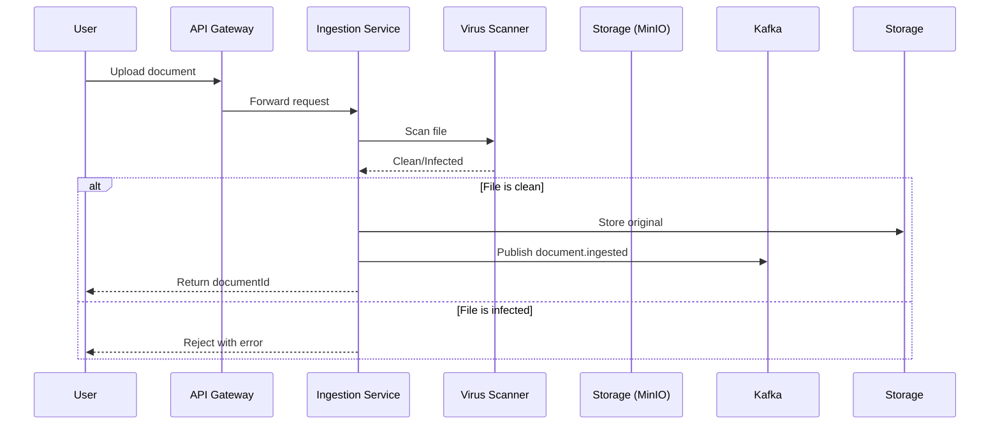

# Apex IDP Technical Design Document

## Document Control

| Item | Value |
|------|-------|
| **Document Title** | Apex Intelligent Document Processing (IDP) Technical Design Document |
| **Version** | 1.0 |
| **Author(s)** | Emma Carter (Lead Solution Architect), Technical Architecture Team |
| **Reviewer(s)** | CTO, Engineering Managers, Security Officer, DevOps Lead, AI/ML Team Lead |
| **Approval Date** | Pending |
| **Repository/Branch** | apex-idp on GitHub (default branch: main) |

---

## 1. Introduction

### 1.1 Purpose

This Technical Design Document provides the comprehensive technical blueprint for implementing the Apex Intelligent Document Processing platform, a revolutionary zero-configuration solution designed to transform healthcare financial operations. Building upon our mission to democratize intelligent document processing, this document translates business requirements into actionable technical specifications, ensuring alignment between our ambitious vision and practical implementation approach.

The document serves as the authoritative technical reference for development teams, outlining architecture decisions, component designs, integration patterns, and deployment strategies that will enable Apex to achieve >99% accuracy rates while processing thousands of documents per hour without manual configuration.

### 1.2 Scope

This design encompasses the complete technical architecture for the Apex Rural Invoice Intelligence Platform and its future extensions into comprehensive vendor management, contract lifecycle management, and financial operations optimization. The scope includes:

**In Scope:**
- Multi-channel document ingestion architecture (web, email, API, scanner)
- AI/ML processing pipeline using ensemble OCR models (Tesseract, LayoutLMv3, DocTR)
- Human-in-the-Loop validation workflows with confidence-based routing
- Knowledge graph construction for semantic search and relationship mapping
- Event-sourced microservices architecture with CQRS implementation
- Integration framework for CPSI TruBridge, eClinicalWorks, and banking systems
- Cloud-native deployment on Kubernetes with auto-scaling capabilities
- Comprehensive security and compliance architecture for HIPAA/SOC 2

**Out of Scope (Phase 1):**
- Direct payment initiation to banking systems
- Handwritten document recognition
- Non-invoice document types (statements, contracts in Phase 1)
- Multi-language support beyond English/Spanish

### 1.3 Audience

This document addresses the technical implementation needs of multiple stakeholders:

- **Software Architects**: System design patterns, architectural decisions, integration strategies
- **Backend Developers**: Service boundaries, API contracts, data models, event schemas
- **Frontend Developers**: UI component architecture, state management, real-time updates
- **AI/ML Engineers**: Model deployment, training pipelines, confidence scoring
- **DevOps Engineers**: Infrastructure requirements, deployment strategies, monitoring
- **QA Engineers**: Testing approaches, performance benchmarks, acceptance criteria
- **Security Officers**: Compliance requirements, encryption strategies, audit mechanisms
- **Product Managers**: Technical constraints, capability boundaries, release planning

---

## 2. System Overview

The Apex IDP platform represents a paradigm shift from traditional document processing systems by implementing a self-optimizing, event-driven architecture that learns and adapts without manual intervention. The system transforms unstructured healthcare documents into structured, actionable intelligence through a sophisticated pipeline of AI models, validation workflows, and integration mechanisms.

### Core Architectural Principles

**Zero-Configuration Philosophy**: The system employs transfer learning and pre-trained models to eliminate manual configuration, achieving production readiness within minutes of deployment. Dynamic model selection based on document characteristics ensures optimal processing without user intervention.

**Event-Driven Processing**: Every system action generates immutable events stored in Apache Kafka, providing complete auditability, enabling event replay for debugging, and supporting CQRS projections for real-time dashboards.

**Bounded Context Separation**: Following Domain-Driven Design, the system separates concerns into distinct microservices: Document Processing, Vendor Management, Financial Operations, Contract Management, and Integration contexts, each with autonomous deployment and scaling.

**Continuous Learning Pipeline**: User corrections automatically trigger model retraining workflows, improving accuracy by 2% monthly through active learning techniques and feedback loops.

### User Interaction Model

The platform serves diverse user personas through tailored interfaces:

**AP Clerks** interact primarily with the validation interface, reviewing only low-confidence extractions while the system handles routine processing automatically. The interface presents documents side-by-side with extracted data, using color-coded confidence indicators (red <0.6, yellow 0.6-0.8, green >0.8) to guide attention.

**Hospital CFOs** access executive dashboards showing real-time AP liability, cash flow projections, and payment scenario modeling tools. The system provides drill-down capabilities from summary metrics to individual invoice details.

**IT Administrators** manage integrations through a configuration portal, monitoring data flows, reviewing audit logs, and managing user access without touching code.

**Vendors** utilize a self-service portal for invoice submission, payment tracking, and profile management, reducing support calls by 80%.

### Processing Intelligence

The system implements a sophisticated cascade of AI models:

1. **Document Classification**: Zero-shot learning identifies document types without training
2. **Layout Analysis**: LayoutLMv3 understands document structure and spatial relationships
3. **Data Extraction**: Ensemble OCR combines Tesseract, DocTR, and custom NER models
4. **Validation Logic**: Business rules and anomaly detection flag suspicious patterns
5. **Knowledge Synthesis**: Graph algorithms identify vendor relationships and patterns

---

## 3. Architecture Overview

### 3.1 Bounded Contexts / Microservices

The Apex platform implements a microservices architecture organized around business capabilities, with each bounded context maintaining its own data model, business logic, and deployment lifecycle:

| Context | Description | Primary Technologies | Key Responsibilities |
|---------|-------------|---------------------|---------------------|
| **Document Ingestion** | Multi-channel document intake and initial processing | Spring Boot 3.x, Apache Kafka, MinIO | • File validation and virus scanning<br>• Format conversion and normalization<br>• Event publication for downstream processing<br>• Batch management and prioritization |
| **Document Classification & Extraction** | AI-powered document understanding and data extraction | Python/Flask, PyTorch, TorchServe, Tesseract, LayoutLMv3, DocTR | • Document type classification<br>• OCR and layout analysis<br>• Table and form extraction<br>• Confidence scoring<br>• Model serving and versioning |
| **Human-in-the-Loop Validation** | User interface for data validation and correction | Next.js 14+, React 18+, TypeScript, WebSocket | • Confidence-based routing<br>• Side-by-side document viewing<br>• Field correction interface<br>• Feedback collection for retraining |
| **Knowledge Graph** | Relationship mapping and semantic search | Neo4j, GraphQL, Elasticsearch | • Entity relationship management<br>• Semantic search capabilities<br>• Pattern detection<br>• Knowledge synthesis |
| **Vendor & Contract Management** | Vendor lifecycle and contract intelligence | Spring Boot, PostgreSQL, NER models | • Vendor master data<br>• Risk scoring algorithms<br>• Contract term extraction<br>• Renewal alerting |
| **Financial Operations** | AP workflows and financial analytics | Spring Boot, Redis, Apache Spark | • Dashboard aggregations<br>• Cash flow modeling<br>• Payment prioritization<br>• Anomaly detection |
| **Integration Layer** | External system connectivity | Spring Cloud Gateway, Apache Camel | • CPSI TruBridge exports<br>• FHIR API connectivity<br>• Webhook management<br>• File format transformations |

### Service Communication Patterns

**Synchronous Communication** (REST/GraphQL):
- UI to backend services for real-time queries
- Integration APIs for external system calls
- Health checks and service discovery

**Asynchronous Communication** (Apache Kafka):
- Document processing pipeline events
- Audit log streaming
- Model retraining triggers
- System notifications

**Event Sourcing Implementation**:
```yaml
Event Topics:
  - document.ingested
  - document.classified
  - extraction.completed
  - validation.requested
  - validation.completed
  - invoice.approved
  - payment.scheduled
  - model.retrained
```

### 3.2 Technology Stack

The platform leverages best-in-class technologies optimized for healthcare document processing:

| Layer | Technology Stack | Justification |
|-------|-----------------|---------------|
| **Frontend** | • Next.js 14+ (React 18+)<br>• TypeScript 5+<br>• Tailwind CSS 3+<br>• shadcn/ui components<br>• Recharts for visualizations<br>• Socket.io for real-time updates | Modern, type-safe development with excellent developer experience and healthcare-appropriate UI components |
| **Backend Services** | • Spring Boot 3.x (Java 17+)<br>• Spring Cloud ecosystem<br>• Apache Kafka 3.x<br>• Redis 7+ for caching<br>• PostgreSQL 15+ | Enterprise-grade reliability, extensive healthcare integration libraries, proven scalability |
| **AI/ML Processing** | • PyTorch 2.0+<br>• TorchServe for model serving<br>• Tesseract 5.0<br>• LayoutLMv3<br>• DocTR<br>• Hugging Face Transformers<br>• ONNX for model optimization | State-of-the-art accuracy, production-ready serving infrastructure, continuous learning capabilities |
| **Data Storage** | • PostgreSQL for transactional data<br>• MinIO for object storage<br>• Neo4j for knowledge graphs<br>• Elasticsearch for full-text search<br>• Apache Kafka for event store | Polyglot persistence optimized for specific data patterns and access requirements |
| **Infrastructure** | • Kubernetes (EKS/GKE/AKS)<br>• Istio service mesh<br>• Terraform for IaC<br>• Helm for packaging<br>• Prometheus & Grafana<br>• Jaeger for tracing | Cloud-agnostic, observable, scalable infrastructure with enterprise monitoring |
| **Security** | • OAuth 2.0/OIDC (Keycloak)<br>• HashiCorp Vault<br>• TLS 1.3 everywhere<br>• SIEM integration<br>• ClamAV for virus scanning | Zero-trust architecture meeting HIPAA and SOC 2 requirements |

---

## 4. Detailed Component Design

### 4.1 Document Ingestion Service

**Responsibilities:**
- Accept documents through multiple channels (web upload, email, API, scanner)
- Perform initial validation and virus scanning
- Convert documents to standardized formats
- Manage batch processing and prioritization
- Publish ingestion events for downstream processing

**API Specification:**
```yaml
POST /api/v1/documents/upload
  Content-Type: multipart/form-data
  Request:
    - file: binary (PDF, TIFF, JPG, PNG up to 50MB)
    - metadata: {
        batchId: string,
        priority: enum(LOW, NORMAL, HIGH, URGENT),
        documentType: string,
        vendorHint: string (optional)
      }
  Response:
    - documentId: uuid
    - status: enum(ACCEPTED, REJECTED)
    - processingUrl: string (WebSocket endpoint)

POST /api/v1/documents/batch
  Request:
    - documents: array of document uploads
    - batchMetadata: batch configuration
  Response:
    - batchId: uuid
    - documentIds: array of uuids
```

**Data Model:**
```sql
-- Core document entity
CREATE TABLE documents (
    id UUID PRIMARY KEY,
    batch_id UUID,
    original_filename VARCHAR(255),
    mime_type VARCHAR(100),
    file_size_bytes BIGINT,
    storage_path VARCHAR(500),
    checksum VARCHAR(64),
    status VARCHAR(50),
    priority VARCHAR(20),
    ingestion_timestamp TIMESTAMP,
    processing_started_at TIMESTAMP,
    processing_completed_at TIMESTAMP,
    retry_count INT DEFAULT 0,
    error_message TEXT,
    metadata JSONB
);

-- Batch management
CREATE TABLE batches (
    id UUID PRIMARY KEY,
    name VARCHAR(255),
    type VARCHAR(100),
    priority VARCHAR(20),
    created_by VARCHAR(255),
    created_at TIMESTAMP,
    total_documents INT,
    processed_documents INT,
    status VARCHAR(50)
);
```

**Processing Workflow:**


**Error Handling:**
- Implement exponential backoff for transient failures
- Dead letter queue for documents failing after 3 retries
- Circuit breaker for downstream service failures
- Detailed error logging with correlation IDs

### 4.2 Document Classification & Extraction Service

**Responsibilities:**
- Classify document types using zero-shot learning
- Perform OCR using ensemble models
- Extract structured data with confidence scores
- Handle table extraction for line items
- Manage model versioning and A/B testing

**AI Model Pipeline:**
```python
class DocumentProcessor:
    def __init__(self):
        self.classifier = ZeroShotClassifier()
        self.layout_model = LayoutLMv3Model()
        self.ocr_engines = {
            'tesseract': TesseractEngine(),
            'doctr': DocTREngine(),
            'textract': AWSTextractEngine()  # Fallback
        }
        self.ner_model = CustomNERModel()
    
    def process(self, document):
        # 1. Classification
        doc_type = self.classifier.classify(document)
        
        # 2. Layout Analysis
        layout = self.layout_model.analyze(document)
        
        # 3. Ensemble OCR
        ocr_results = self.ensemble_ocr(document, layout)
        
        # 4. Entity Extraction
        entities = self.extract_entities(ocr_results, doc_type)
        
        # 5. Confidence Scoring
        confidence_scores = self.calculate_confidence(entities)
        
        return ProcessingResult(
            document_type=doc_type,
            entities=entities,
            confidence=confidence_scores,
            layout=layout
        )
    
    def ensemble_ocr(self, document, layout):
        results = {}
        for engine_name, engine in self.ocr_engines.items():
            results[engine_name] = engine.process(document, layout)
        
        # Voting mechanism for consensus
        return self.merge_ocr_results(results)
```

**Extraction Schema:**
```json
{
  "documentId": "uuid",
  "documentType": "INVOICE",
  "confidence": 0.95,
  "extractedData": {
    "header": {
      "vendorName": {"value": "Acme Corp", "confidence": 0.98},
      "invoiceNumber": {"value": "INV-2025-001", "confidence": 0.99},
      "invoiceDate": {"value": "2025-01-15", "confidence": 0.97},
      "dueDate": {"value": "2025-02-15", "confidence": 0.94},
      "poNumber": {"value": "PO-12345", "confidence": 0.92},
      "subtotal": {"value": 1000.00, "confidence": 0.99},
      "tax": {"value": 80.00, "confidence": 0.98},
      "total": {"value": 1080.00, "confidence": 0.99}
    },
    "lineItems": [
      {
        "itemCode": {"value": "SKU-001", "confidence": 0.95},
        "description": {"value": "Medical Supplies", "confidence": 0.93},
        "quantity": {"value": 10, "confidence": 0.98},
        "unitPrice": {"value": 100.00, "confidence": 0.97},
        "lineTotal": {"value": 1000.00, "confidence": 0.99}
      }
    ]
  },
  "validationRequired": ["dueDate", "description"],
  "processingMetadata": {
    "processingTime": 45.2,
    "modelsUsed": ["layoutlmv3_v2.1", "tesseract_5.0", "doctr_0.6"],
    "gpuUtilization": 0.65
  }
}
```

**Model Management:**
- Blue-green deployment for model updates
- A/B testing framework for accuracy comparison
- Model versioning with rollback capabilities
- Performance monitoring and drift detection

### 4.3 Human-in-the-Loop Validation Service

**Responsibilities:**
- Route documents based on confidence thresholds
- Provide intuitive validation interface
- Capture user corrections for model improvement
- Manage validation workflows and approvals

**Frontend Architecture:**
```typescript
// React component structure
interface ValidationComponentProps {
  document: Document;
  extractedData: ExtractedData;
  onValidate: (corrections: Corrections) => void;
}

const DocumentValidation: React.FC<ValidationComponentProps> = ({
  document,
  extractedData,
  onValidate
}) => {
  const [corrections, setCorrections] = useState<Corrections>({});
  const [activeField, setActiveField] = useState<string | null>(null);
  
  // WebSocket connection for real-time updates
  const { connected, updates } = useWebSocket(document.id);
  
  return (
    <div className="flex h-screen">
      {/* Document Viewer */}
      <div className="w-1/2 overflow-auto">
        <DocumentViewer 
          document={document}
          highlights={getFieldHighlights(activeField)}
          onFieldClick={setActiveField}
        />
      </div>
      
      {/* Validation Form */}
      <div className="w-1/2 p-4 overflow-auto">
        <ValidationForm
          extractedData={extractedData}
          corrections={corrections}
          onFieldChange={(field, value) => {
            setCorrections({...corrections, [field]: value});
            trackCorrection(field, value);
          }}
          confidenceThreshold={0.8}
        />
        
        {/* Line Items Grid */}
        <LineItemsGrid
          items={extractedData.lineItems}
          onEdit={handleLineItemEdit}
          onAdd={handleLineItemAdd}
          onDelete={handleLineItemDelete}
        />
        
        <ValidationActions
          onSave={() => onValidate(corrections)}
          onSkip={handleSkip}
          onReject={handleReject}
        />
      </div>
    </div>
  );
};
```

**Validation Rules Engine:**
```java
@Component
public class ValidationRulesEngine {
    
    private final List<ValidationRule> rules = Arrays.asList(
        new DateConsistencyRule(),
        new TotalCalculationRule(),
        new VendorVerificationRule(),
        new DuplicateInvoiceRule(),
        new ThresholdValidationRule()
    );
    
    public ValidationResult validate(ExtractedData data) {
        ValidationResult result = new ValidationResult();
        
        for (ValidationRule rule : rules) {
            RuleResult ruleResult = rule.apply(data);
            if (!ruleResult.isValid()) {
                result.addViolation(ruleResult.getViolation());
            }
        }
        
        // Confidence-based routing
        if (hasLowConfidenceFields(data)) {
            result.requiresHumanValidation(true);
        }
        
        return result;
    }
    
    private boolean hasLowConfidenceFields(ExtractedData data) {
        return data.getFields().stream()
            .anyMatch(field -> field.getConfidence() < 0.8);
    }
}
```

### 4.4 Knowledge Graph Service

**Responsibilities:**
- Build and maintain entity relationships
- Provide semantic search capabilities
- Detect patterns and anomalies
- Support natural language queries

**Graph Schema (Neo4j):**
```cypher
// Core entities
CREATE (v:Vendor {
    id: 'uuid',
    name: 'string',
    taxId: 'string',
    riskScore: 0.0,
    status: 'ACTIVE'
})

CREATE (i:Invoice {
    id: 'uuid',
    number: 'string',
    date: date(),
    amount: 0.0,
    status: 'PENDING'
})

CREATE (p:Product {
    id: 'uuid',
    code: 'string',
    description: 'string',
    category: 'string'
})

CREATE (c:Contract {
    id: 'uuid',
    number: 'string',
    startDate: date(),
    endDate: date(),
    value: 0.0
})

// Relationships
CREATE (v)-[:ISSUED]->(i)
CREATE (i)-[:CONTAINS {quantity: 10, unitPrice: 100.0}]->(p)
CREATE (v)-[:HAS_CONTRACT]->(c)
CREATE (i)-[:RELATED_TO]->(c)
```

**Semantic Search Implementation:**
```python
class KnowledgeGraphSearch:
    def __init__(self):
        self.driver = GraphDatabase.driver(uri, auth=(user, password))
        self.embeddings = SentenceTransformer('all-MiniLM-L6-v2')
        
    def search(self, query: str, limit: int = 10):
        # Generate query embedding
        query_embedding = self.embeddings.encode(query)
        
        # Vector similarity search
        with self.driver.session() as session:
            result = session.run("""
                CALL db.index.vector.queryNodes('invoice_embeddings', $limit, $embedding)
                YIELD node, score
                MATCH (node)-[r]-(related)
                RETURN node, collect(related) as context, score
                ORDER BY score DESC
            """, embedding=query_embedding.tolist(), limit=limit)
            
        return self.format_results(result)
    
    def answer_question(self, question: str):
        # Use RAG pattern for natural language Q&A
        context = self.search(question, limit=5)
        prompt = self.build_prompt(question, context)
        
        # Call LLM for answer generation
        answer = self.llm.generate(prompt)
        
        return {
            'answer': answer,
            'sources': context,
            'confidence': self.calculate_confidence(answer, context)
        }
```

### 4.5 Financial Operations Service

**Responsibilities:**
- Generate real-time AP dashboards
- Model payment scenarios
- Detect anomalies and fraud patterns
- Forecast cash flow requirements

**Dashboard Aggregation Pipeline:**
```java
@Service
public class DashboardService {
    
    @Autowired
    private RedisTemplate<String, Object> redisTemplate;
    
    @Cacheable(value = "dashboard", key = "#userId")
    public DashboardData getDashboard(String userId) {
        DashboardData dashboard = new DashboardData();
        
        // Real-time metrics from event projections
        dashboard.setTotalAPLiability(getTotalAPLiability());
        dashboard.setAgingBuckets(getAgingAnalysis());
        dashboard.setCashFlowProjection(projectCashFlow(30));
        dashboard.setVendorMetrics(getTopVendorMetrics());
        
        // Anomaly detection results
        dashboard.setAnomalies(detectAnomalies());
        
        return dashboard;
    }
    
    private CashFlowProjection projectCashFlow(int days) {
        // Monte Carlo simulation for cash flow
        MonteCarloSimulation simulation = new MonteCarloSimulation();
        
        simulation.setHistoricalData(getHistoricalPayments());
        simulation.setOutstandingInvoices(getOutstandingInvoices());
        simulation.setPaymentTerms(getVendorPaymentTerms());
        
        return simulation.run(1000); // 1000 iterations
    }
    
    @StreamListener("invoice-events")
    public void updateProjections(InvoiceEvent event) {
        // Update CQRS projections in Redis
        String key = "ap:liability:" + event.getVendorId();
        redisTemplate.opsForValue().increment(key, event.getAmount());
        
        // Trigger dashboard refresh via WebSocket
        messagingTemplate.convertAndSend(
            "/topic/dashboard/" + event.getUserId(),
            new DashboardUpdate(event)
        );
    }
}
```

**Payment Scenario Modeling:**
```typescript
interface PaymentScenario {
  availableCash: number;
  invoices: Invoice[];
  constraints: PaymentConstraints;
}

class PaymentOptimizer {
  optimize(scenario: PaymentScenario): PaymentPlan {
    // Multi-objective optimization
    const objectives = [
      this.minimizeLateFees,
      this.maintainVendorRelations,
      this.optimizeCashFlow,
      this.prioritizeCriticalVendors
    ];
    
    // Genetic algorithm for optimal payment schedule
    const ga = new GeneticAlgorithm({
      populationSize: 100,
      generations: 500,
      mutationRate: 0.1,
      crossoverRate: 0.7,
      fitnessFunction: (solution) => 
        this.calculateFitness(solution, objectives, scenario)
    });
    
    const optimalSolution = ga.evolve();
    
    return this.buildPaymentPlan(optimalSolution, scenario);
  }
  
  private calculateFitness(
    solution: number[],
    objectives: ObjectiveFunction[],
    scenario: PaymentScenario
  ): number {
    return objectives.reduce((score, objective) => 
      score + objective(solution, scenario), 0
    );
  }
}
```

### 4.6 Integration Service

**Responsibilities:**
- Manage external system connections
- Transform data formats
- Handle authentication and authorization
- Provide webhook endpoints

**CPSI TruBridge Integration:**
```java
@Component
public class CPSIIntegration {
    
    @Scheduled(cron = "0 0 */4 * * *") // Every 4 hours
    public void exportToTruBridge() {
        List<Invoice> approvedInvoices = invoiceRepository
            .findByStatusAndExportedFalse(InvoiceStatus.APPROVED);
        
        if (!approvedInvoices.isEmpty()) {
            CPSIExportFile exportFile = buildExportFile(approvedInvoices);
            
            try {
                // Generate CSV in CPSI format
                String csvContent = generateCSV(exportFile);
                
                // Transfer via secure FTP or API
                if (config.useAPI()) {
                    cpsiClient.uploadBatch(csvContent);
                } else {
                    sftpClient.upload(csvContent, generateFilename());
                }
                
                // Mark invoices as exported
                invoices.forEach(i -> i.setExported(true));
                invoiceRepository.saveAll(invoices);
                
                // Send confirmation
                notificationService.notifyExportSuccess(invoices.size());
                
            } catch (Exception e) {
                handleExportFailure(e, invoices);
            }
        }
    }
    
    private String generateCSV(CPSIExportFile file) {
        StringBuilder csv = new StringBuilder();
        
        // Header row per CPSI specification
        csv.append("H,").append(file.getBatchId())
           .append(",").append(file.getCreatedDate())
           .append(",").append(file.getTotalRecords())
           .append("\n");
        
        // Detail rows
        for (CPSIRecord record : file.getRecords()) {
            csv.append("D,")
               .append(record.getVendorId()).append(",")
               .append(record.getInvoiceNumber()).append(",")
               .append(record.getInvoiceDate()).append(",")
               .append(record.getAmount()).append(",")
               .append(record.getGLCode()).append(",")
               .append(record.getDepartment())
               .append("\n");
        }
        
        // Trailer row
        csv.append("T,").append(file.getTotalAmount())
           .append(",").append(file.getChecksum())
           .append("\n");
        
        return csv.toString();
    }
}
```

**FHIR Integration for eClinicalWorks:**
```python
class FHIRIntegration:
    def __init__(self):
        self.fhir_client = FHIRClient(settings={
            'app_id': 'apex_idp',
            'api_base': config.FHIR_BASE_URL
        })
        
    def sync_departments(self):
        """Sync department mappings from EHR"""
        
        # Query Organization resources
        search = Organization.where(struct={'type': 'dept'})
        departments = search.perform_resources(self.fhir_client.server)
        
        for dept in departments:
            self.update_department_mapping({
                'fhir_id': dept.id,
                'name': dept.name,
                'identifier': dept.identifier[0].value,
                'cost_center': self.extract_cost_center(dept)
            })
    
    def allocate_costs(self, invoice):
        """Allocate invoice costs to departments based on usage"""
        
        # Get relevant Encounters for time period
        search = Encounter.where(struct={
            'date': f'ge{invoice.date - timedelta(days=30)}',
            'date': f'le{invoice.date}'
        })
        
        encounters = search.perform_resources(self.fhir_client.server)
        
        # Calculate department utilization
        dept_usage = self.calculate_usage_percentages(encounters)
        
        # Allocate costs proportionally
        allocations = []
        for dept_id, percentage in dept_usage.items():
            allocations.append({
                'department_id': dept_id,
                'amount': invoice.amount * percentage,
                'basis': 'patient_volume'
            })
        
        return allocations
```

---

## 5. Data & Storage Design

### 5.1 Database Schema

**PostgreSQL Transactional Schema:**

```sql
-- Vendor management
CREATE TABLE vendors (
    id UUID PRIMARY KEY DEFAULT gen_random_uuid(),
    name VARCHAR(255) NOT NULL,
    tax_id VARCHAR(50) UNIQUE,
    dba_name VARCHAR(255),
    status VARCHAR(50) DEFAULT 'ACTIVE',
    risk_score DECIMAL(3,2) DEFAULT 0.00,
    risk_factors JSONB,
    baa_status VARCHAR(50),
    baa_expiry_date DATE,
    created_at TIMESTAMP DEFAULT NOW(),
    updated_at TIMESTAMP DEFAULT NOW(),
    metadata JSONB
);

CREATE INDEX idx_vendors_name ON vendors(name);
CREATE INDEX idx_vendors_risk ON vendors(risk_score);
CREATE INDEX idx_vendors_status ON vendors(status);

-- Invoice processing
CREATE TABLE invoices (
    id UUID PRIMARY KEY DEFAULT gen_random_uuid(),
    document_id UUID REFERENCES documents(id),
    vendor_id UUID REFERENCES vendors(id),
    invoice_number VARCHAR(100),
    invoice_date DATE,
    due_date DATE,
    po_number VARCHAR(100),
    subtotal DECIMAL(15,2),
    tax DECIMAL(15,2),
    shipping DECIMAL(15,2),
    total DECIMAL(15,2) NOT NULL,
    currency VARCHAR(3) DEFAULT 'USD',
    status VARCHAR(50) DEFAULT 'PENDING',
    approval_status VARCHAR(50),
    approved_by VARCHAR(255),
    approved_at TIMESTAMP,
    exported BOOLEAN DEFAULT FALSE,
    exported_at TIMESTAMP,
    created_at TIMESTAMP DEFAULT NOW(),
    updated_at TIMESTAMP DEFAULT NOW(),
    extracted_data JSONB,
    validation_data JSONB
);

CREATE INDEX idx_invoices_vendor ON invoices(vendor_id);
CREATE INDEX idx_invoices_status ON invoices(status);
CREATE INDEX idx_invoices_date ON invoices(invoice_date);
CREATE INDEX idx_invoices_number ON invoices(invoice_number);

-- Line items
CREATE TABLE invoice_line_items (
    id UUID PRIMARY KEY DEFAULT gen_random_uuid(),
    invoice_id UUID REFERENCES invoices(id) ON DELETE CASCADE,
    line_number INT,
    item_code VARCHAR(100),
    description TEXT,
    quantity DECIMAL(10,3),
    unit_price DECIMAL(15,4),
    unit_of_measure VARCHAR(20),
    line_total DECIMAL(15,2),
    gl_code VARCHAR(50),
    department_id VARCHAR(100),
    confidence_scores JSONB,
    created_at TIMESTAMP DEFAULT NOW()
);

CREATE INDEX idx_line_items_invoice ON invoice_line_items(invoice_id);

-- Contracts
CREATE TABLE contracts (
    id UUID PRIMARY KEY DEFAULT gen_random_uuid(),
    vendor_id UUID REFERENCES vendors(id),
    contract_number VARCHAR(100) UNIQUE,
    effective_date DATE,
    expiration_date DATE,
    auto_renewal BOOLEAN DEFAULT FALSE,
    renewal_notice_days INT,
    cancellation_notice_days INT,
    total_value DECIMAL(15,2),
    payment_terms VARCHAR(100),
    status VARCHAR(50) DEFAULT 'ACTIVE',
    document_id UUID REFERENCES documents(id),
    extracted_terms JSONB,
    alerts_config JSONB,
    created_at TIMESTAMP DEFAULT NOW(),
    updated_at TIMESTAMP DEFAULT NOW()
);

CREATE INDEX idx_contracts_vendor ON contracts(vendor_id);
CREATE INDEX idx_contracts_expiration ON contracts(expiration_date);
CREATE INDEX idx_contracts_status ON contracts(status);

-- Audit trail
CREATE TABLE audit_events (
    id UUID PRIMARY KEY DEFAULT gen_random_uuid(),
    event_type VARCHAR(100) NOT NULL,
    entity_type VARCHAR(100) NOT NULL,
    entity_id UUID NOT NULL,
    user_id VARCHAR(255),
    timestamp TIMESTAMP DEFAULT NOW(),
    changes JSONB,
    metadata JSONB,
    ip_address INET,
    user_agent TEXT
);

CREATE INDEX idx_audit_entity ON audit_events(entity_type, entity_id);
CREATE INDEX idx_audit_user ON audit_events(user_id);
CREATE INDEX idx_audit_timestamp ON audit_events(timestamp);
```

### 5.2 Object Storage Layout (MinIO/S3)

```
apex-idp-storage/
├── documents/
│   ├── original/
│   │   └── {year}/{month}/{day}/{document_id}/
│   │       └── {original_filename}
│   ├── processed/
│   │   └── {year}/{month}/{day}/{document_id}/
│   │       ├── normalized.pdf
│   │       ├── page_{n}.png
│   │       └── extracted.json
│   └── thumbnails/
│       └── {document_id}/
│           └── thumb_{n}.jpg
├── models/
│   ├── classification/
│   │   └── {model_version}/
│   ├── extraction/
│   │   └── {model_version}/
│   └── ner/
│       └── {model_version}/
├── exports/
│   ├── cpsi/
│   │   └── {year}/{month}/{batch_id}.csv
│   └── reports/
│       └── {year}/{month}/{report_id}.pdf
└── backups/
    └── {date}/
        └── {backup_id}/
```

### 5.3 Knowledge Graph Schema (Neo4j)

```cypher
// Define constraints and indexes
CREATE CONSTRAINT vendor_id_unique ON (v:Vendor) ASSERT v.id IS UNIQUE;
CREATE CONSTRAINT invoice_id_unique ON (i:Invoice) ASSERT i.id IS UNIQUE;
CREATE CONSTRAINT product_code_unique ON (p:Product) ASSERT p.code IS UNIQUE;

CREATE INDEX vendor_name FOR (v:Vendor) ON (v.name);
CREATE INDEX invoice_date FOR (i:Invoice) ON (i.date);
CREATE INDEX product_category FOR (p:Product) ON (p.category);

// Vector indexes for semantic search
CALL db.index.vector.createNodeIndex(
  'invoice_embeddings',
  'Invoice',
  'embedding',
  768,
  'cosine'
);

// Example relationship patterns
MATCH (v:Vendor {name: 'Medical Supplies Inc'})
MATCH (i:Invoice {number: 'INV-2025-001'})
CREATE (v)-[:ISSUED {timestamp: datetime()}]->(i)

MATCH (i:Invoice {number: 'INV-2025-001'})
MATCH (p:Product {code: 'MED-GLOVES-L'})
CREATE (i)-[:CONTAINS {
  quantity: 100,
  unitPrice: 0.50,
  lineTotal: 50.00
}]->(p)

// Pattern detection queries
MATCH (v:Vendor)-[:ISSUED]->(i:Invoice)
WHERE i.date > date() - duration('P3M')
WITH v, COUNT(i) as invoice_count, SUM(i.total) as total_spend
WHERE invoice_count > 10
RETURN v.name, invoice_count, total_spend
ORDER BY total_spend DESC
```

### 5.4 Event Store Schema (Kafka)

```yaml
Topics:
  - name: document.events
    partitions: 10
    replication: 3
    retention: 7d
    schema:
      type: Avro
      fields:
        - documentId: string
        - eventType: enum
        - timestamp: long
        - userId: string
        - payload: record

  - name: invoice.events
    partitions: 10
    replication: 3
    retention: 30d
    schema:
      type: Avro
      fields:
        - invoiceId: string
        - vendorId: string
        - eventType: enum
        - amount: decimal
        - timestamp: long
        - metadata: map

  - name: model.training
    partitions: 3
    replication: 3
    retention: 90d
    schema:
      type: JSON
      structure:
        modelType: string
        version: string
        trainingData: array
        corrections: array
        timestamp: ISO8601
```

---

## 6. External Integration Design

### 6.1 ERP/EHR Integration Architecture

**CPSI TruBridge Integration:**
```yaml
Integration Profile:
  System: CPSI TruBridge
  Type: Bi-directional
  Protocols: 
    - REST API (primary)
    - SFTP (fallback)
    - HL7 FHIR (future)
  
  Data Flows:
    Export to CPSI:
      - Approved invoices
      - Vendor master updates
      - Payment schedules
      Format: CSV (CPSI specification v3.2)
      Frequency: Every 4 hours
      Volume: ~500 records per batch
    
    Import from CPSI:
      - Payment confirmations
      - GL account mappings
      - Vendor updates
      Format: JSON via webhook
      Real-time: Yes
      
  Authentication:
    Method: OAuth 2.0 Client Credentials
    Token Refresh: Every 55 minutes
    Backup: API Key authentication
```

**eClinicalWorks Integration:**
```yaml
Integration Profile:
  System: eClinicalWorks
  Type: Read-only
  Protocol: FHIR R4
  
  Resources Accessed:
    - Organization (departments)
    - Location (cost centers)
    - Encounter (utilization data)
    - Practitioner (approvers)
    
  Use Cases:
    - Department mapping for cost allocation
    - Utilization-based invoice distribution
    - Approval routing based on department
    
  Authentication:
    Method: SMART on FHIR
    Scopes: 
      - system/Organization.read
      - system/Encounter.read
      - system/Location.read
```

### 6.2 Email Integration

```python
class EmailIngestionService:
    def __init__(self):
        self.imap_client = IMAPClient(
            host=config.EMAIL_HOST,
            use_ssl=True
        )
        self.parser = EmailParser()
        self.virus_scanner = ClamAVScanner()
        
    def process_emails(self):
        """Process unread emails with attachments"""
        
        self.imap_client.login(config.EMAIL_USER, config.EMAIL_PASS)
        self.imap_client.select_folder('INBOX')
        
        # Search for unread emails with attachments
        messages = self.imap_client.search(['UNSEEN', 'HAS ATTACHMENT'])
        
        for msg_id in messages:
            try:
                email = self.imap_client.fetch([msg_id], ['RFC822'])[msg_id]
                parsed = self.parser.parse(email[b'RFC822'])
                
                # Process each attachment
                for attachment in parsed.attachments:
                    if self.is_valid_document(attachment):
                        # Scan for viruses
                        if self.virus_scanner.is_clean(attachment.content):
                            # Upload to document service
                            document_id = self.upload_document(
                                attachment,
                                metadata={
                                    'source': 'email',
                                    'sender': parsed.sender,
                                    'subject': parsed.subject,
                                    'received': parsed.date
                                }
                            )
                            
                            # Send confirmation
                            self.send_confirmation(parsed.sender, document_id)
                        else:
                            self.quarantine(attachment, parsed.sender)
                
                # Mark as processed
                self.imap_client.add_flags([msg_id], ['\\Seen', 'Processed'])
                
            except Exception as e:
                logger.error(f"Error processing email {msg_id}: {e}")
                self.imap_client.add_flags([msg_id], ['\\Flagged'])
```

### 6.3 Banking Integration

```java
@Service
public class ACHFileGenerator {
    
    public void generateACHFile(List<Payment> payments) {
        NACHAFile nachaFile = new NACHAFile();
        
        // File Header Record
        FileHeader header = new FileHeader();
        header.setPriorityCode("01");
        header.setImmediateDestination(config.getBankRoutingNumber());
        header.setImmediateOrigin(config.getCompanyId());
        header.setFileCreationDate(LocalDate.now());
        header.setFileIdModifier("A");
        nachaFile.setHeader(header);
        
        // Batch Header Record
        BatchHeader batchHeader = new BatchHeader();
        batchHeader.setServiceClassCode("200"); // Mixed debits and credits
        batchHeader.setCompanyName(config.getCompanyName());
        batchHeader.setCompanyId(config.getCompanyId());
        batchHeader.setEntryDescription("VENDOR PAY");
        batchHeader.setEffectiveDate(LocalDate.now().plusDays(1));
        
        // Entry Detail Records
        for (Payment payment : payments) {
            EntryDetail entry = new EntryDetail();
            entry.setTransactionCode(getTransactionCode(payment));
            entry.setRoutingNumber(payment.getVendor().getRoutingNumber());
            entry.setAccountNumber(payment.getVendor().getAccountNumber());
            entry.setAmount(payment.getAmount());
            entry.setIdentificationNumber(payment.getInvoiceNumber());
            entry.setReceiverName(payment.getVendor().getName());
            entry.setTraceNumber(generateTraceNumber());
            
            batchHeader.addEntry(entry);
        }
        
        // Batch Control Record
        BatchControl batchControl = new BatchControl();
        batchControl.setServiceClassCode("200");
        batchControl.setEntryCount(payments.size());
        batchControl.setTotalDebits(calculateTotalDebits(payments));
        batchControl.setTotalCredits(calculateTotalCredits(payments));
        
        // File Control Record
        FileControl fileControl = new FileControl();
        fileControl.setBatchCount(1);
        fileControl.setBlockCount(calculateBlockCount(nachaFile));
        fileControl.setEntryCount(payments.size());
        fileControl.setTotalDebits(batchControl.getTotalDebits());
        fileControl.setTotalCredits(batchControl.getTotalCredits());
        
        // Write file
        String achContent = nachaFile.format();
        uploadToBank(achContent);
    }
}
```

### 6.4 Webhook Management

```typescript
interface WebhookConfig {
  url: string;
  events: string[];
  secret: string;
  retryPolicy: RetryPolicy;
  active: boolean;
}

class WebhookService {
  async emit(event: SystemEvent) {
    const subscribers = await this.getSubscribers(event.type);
    
    for (const subscriber of subscribers) {
      const payload = this.buildPayload(event, subscriber);
      const signature = this.sign(payload, subscriber.secret);
      
      try {
        await this.sendWithRetry(
          subscriber.url,
          payload,
          signature,
          subscriber.retryPolicy
        );
        
        await this.logDelivery(subscriber, event, 'SUCCESS');
      } catch (error) {
        await this.handleFailure(subscriber, event, error);
      }
    }
  }
  
  private async sendWithRetry(
    url: string,
    payload: any,
    signature: string,
    policy: RetryPolicy
  ) {
    return retry(
      async () => {
        const response = await axios.post(url, payload, {
          headers: {
            'X-Apex-Signature': signature,
            'X-Apex-Event': payload.event,
            'X-Apex-Timestamp': payload.timestamp
          },
          timeout: 30000
        });
        
        if (response.status >= 500) {
          throw new Error(`Server error: ${response.status}`);
        }
        
        return response;
      },
      {
        retries: policy.maxRetries,
        factor: policy.backoffFactor,
        minTimeout: policy.minDelay,
        maxTimeout: policy.maxDelay
      }
    );
  }
}
```

---

## 7. Security & Compliance

### 7.1 Zero-Trust Security Architecture

The Apex platform implements a comprehensive zero-trust security model where no component is implicitly trusted:

**Network Security:**
```yaml
Service Mesh Configuration (Istio):
  PeerAuthentication:
    mode: STRICT  # Enforce mTLS everywhere
    
  AuthorizationPolicy:
    - service-to-service communication explicitly allowed
    - Default deny for all unspecified traffic
    - Rate limiting per service
    
  NetworkPolicies:
    - Ingress/Egress rules per namespace
    - Database access restricted to specific services
    - External API calls through egress gateway
```

**Authentication & Authorization:**
```java
@Configuration
@EnableWebSecurity
public class SecurityConfig {
    
    @Bean
    public SecurityFilterChain filterChain(HttpSecurity http) {
        return http
            .authorizeHttpRequests(auth -> auth
                .requestMatchers("/api/public/**").permitAll()
                .requestMatchers("/api/admin/**").hasRole("ADMIN")
                .requestMatchers("/api/validate/**").hasAnyRole("VALIDATOR", "ADMIN")
                .anyRequest().authenticated()
            )
            .oauth2ResourceServer(oauth2 -> oauth2
                .jwt(jwt -> jwt
                    .jwtAuthenticationConverter(jwtAuthenticationConverter())
                )
            )
            .sessionManagement(session -> session
                .sessionCreationPolicy(SessionCreationPolicy.STATELESS)
            )
            .cors(cors -> cors.configurationSource(corsConfigurationSource()))
            .csrf(csrf -> csrf.disable())
            .build();
    }
    
    @Bean
    public JwtAuthenticationConverter jwtAuthenticationConverter() {
        JwtAuthenticationConverter converter = new JwtAuthenticationConverter();
        converter.setJwtGrantedAuthoritiesConverter(jwt -> {
            // Extract roles from JWT claims
            Collection<String> roles = jwt.getClaimAsStringList("roles");
            return roles.stream()
                .map(role -> new SimpleGrantedAuthority("ROLE_" + role))
                .collect(Collectors.toList());
        });
        return converter;
    }
}
```

### 7.2 Data Protection

**Encryption Implementation:**
```python
class EncryptionService:
    def __init__(self):
        # Use AWS KMS for key management
        self.kms_client = boto3.client('kms')
        self.data_key_cache = {}
        
    def encrypt_document(self, document: bytes, context: dict) -> EncryptedDocument:
        # Generate data encryption key
        data_key = self.get_or_create_data_key(context)
        
        # Encrypt document with AES-256-GCM
        cipher = Cipher(
            algorithms.AES(data_key.plaintext),
            modes.GCM(os.urandom(12))
        )
        encryptor = cipher.encryptor()
        
        ciphertext = encryptor.update(document) + encryptor.finalize()
        
        return EncryptedDocument(
            ciphertext=ciphertext,
            tag=encryptor.tag,
            key_id=data_key.key_id,
            context=context
        )
    
    def decrypt_document(self, encrypted: EncryptedDocument) -> bytes:
        # Retrieve data key from KMS
        data_key = self.kms_client.decrypt(
            CiphertextBlob=encrypted.key_id,
            EncryptionContext=encrypted.context
        )
        
        # Decrypt document
        cipher = Cipher(
            algorithms.AES(data_key['Plaintext']),
            modes.GCM(encrypted.tag)
        )
        decryptor = cipher.decryptor()
        
        return decryptor.update(encrypted.ciphertext) + decryptor.finalize()
```

### 7.3 HIPAA Compliance

**PHI Protection Measures:**
```yaml
Technical Safeguards:
  Access Control:
    - Unique user identification
    - Automatic logoff after 15 minutes
    - Encryption and decryption
    
  Audit Controls:
    - Hardware, software, and procedural mechanisms
    - Record and examine access and activity
    - Immutable audit logs
    
  Integrity Controls:
    - Electronic mechanisms to ensure PHI not altered
    - Version control for all documents
    - Checksums for data validation
    
  Transmission Security:
    - TLS 1.3 for all data in transit
    - VPN requirements for remote access
    - Secure email gateway for PHI

Administrative Safeguards:
  - Security Officer designation
  - Workforce training program
  - Access management procedures
  - Business Associate Agreements

Physical Safeguards:
  - Data center compliance (SOC 2 Type II)
  - Workstation security policies
  - Device and media controls
```

**BAA Management System:**
```java
@Entity
public class BusinessAssociateAgreement {
    @Id
    private UUID id;
    
    @ManyToOne
    private Vendor vendor;
    
    private LocalDate effectiveDate;
    private LocalDate expirationDate;
    private String documentPath;
    private BAAStatus status;
    
    @PrePersist
    @PreUpdate
    public void validateBAA() {
        if (vendor.handlessPHI() && !isValid()) {
            throw new ComplianceException(
                "Valid BAA required for vendors handling PHI"
            );
        }
    }
    
    public boolean isValid() {
        return status == BAAStatus.EXECUTED 
            && expirationDate.isAfter(LocalDate.now());
    }
}
```

### 7.4 Audit Logging

**Comprehensive Audit Trail:**
```typescript
interface AuditEvent {
  id: string;
  timestamp: Date;
  userId: string;
  action: string;
  entityType: string;
  entityId: string;
  changes: ChangeSet;
  ipAddress: string;
  userAgent: string;
  sessionId: string;
  result: 'SUCCESS' | 'FAILURE';
  errorDetails?: string;
}

class AuditService {
  async logEvent(event: AuditEvent) {
    // Sign event for tamper detection
    event.signature = this.signEvent(event);
    
    // Store in immutable audit log
    await this.auditRepository.create(event);
    
    // Stream to SIEM
    await this.siemClient.send(event);
    
    // Check for suspicious patterns
    if (this.isSuspicious(event)) {
      await this.alertSecurityTeam(event);
    }
  }
  
  private isSuspicious(event: AuditEvent): boolean {
    const patterns = [
      this.checkRapidAccessPattern,
      this.checkUnusualTimeAccess,
      this.checkDataExfiltration,
      this.checkPrivilegeEscalation
    ];
    
    return patterns.some(pattern => pattern(event));
  }
}
```

---

## 8. Scalability, Performance & Reliability

### 8.1 Performance Requirements & Benchmarks

```yaml
Performance Targets:
  Document Processing:
    - OCR Speed: <500ms per page
    - End-to-end: <60 seconds per document
    - Throughput: 1000+ documents/hour
    - Concurrent Processing: 100 documents
    
  API Response Times:
    - Read Operations: p95 < 200ms
    - Write Operations: p95 < 500ms
    - Search Queries: p95 < 2s
    - Dashboard Load: < 3s initial, < 100ms updates
    
  System Resources:
    - CPU Utilization: < 70% average
    - Memory Usage: < 80% of allocated
    - Storage IOPS: 10,000+ sustained
    - Network Latency: < 10ms inter-service
```

### 8.2 Horizontal Scaling Strategy

**Kubernetes HPA Configuration:**
```yaml
apiVersion: autoscaling/v2
kind: HorizontalPodAutoscaler
metadata:
  name: document-processor-hpa
spec:
  scaleTargetRef:
    apiVersion: apps/v1
    kind: Deployment
    name: document-processor
  minReplicas: 3
  maxReplicas: 50
  metrics:
  - type: Resource
    resource:
      name: cpu
      target:
        type: Utilization
        averageUtilization: 60
  - type: Resource
    resource:
      name: memory
      target:
        type: Utilization
        averageUtilization: 70
  - type: Pods
    pods:
      metric:
        name: kafka_consumer_lag
      target:
        type: AverageValue
        averageValue: "30"
  behavior:
    scaleUp:
      stabilizationWindowSeconds: 60
      policies:
      - type: Percent
        value: 50
        periodSeconds: 60
      - type: Pods
        value: 5
        periodSeconds: 60
    scaleDown:
      stabilizationWindowSeconds: 300
      policies:
      - type: Percent
        value: 25
        periodSeconds: 120
```

### 8.3 Caching Strategy

```java
@Configuration
@EnableCaching
public class CacheConfig {
    
    @Bean
    public RedisCacheManager cacheManager(RedisConnectionFactory factory) {
        RedisCacheConfiguration config = RedisCacheConfiguration
            .defaultCacheConfig()
            .serializeKeysWith(RedisSerializationContext.SerializationPair
                .fromSerializer(new StringRedisSerializer()))
            .serializeValuesWith(RedisSerializationContext.SerializationPair
                .fromSerializer(new GenericJackson2JsonRedisSerializer()));
        
        return RedisCacheManager.builder(factory)
            .cacheDefaults(config)
            .withCacheConfiguration("vendors",
                config.entryTtl(Duration.ofHours(24)))
            .withCacheConfiguration("dashboards",
                config.entryTtl(Duration.ofMinutes(5)))
            .withCacheConfiguration("documents",
                config.entryTtl(Duration.ofHours(1)))
            .build();
    }
    
    @Bean
    public RedisTemplate<String, Object> redisTemplate(
            RedisConnectionFactory factory) {
        RedisTemplate<String, Object> template = new RedisTemplate<>();
        template.setConnectionFactory(factory);
        
        // Configure serialization
        template.setKeySerializer(new StringRedisSerializer());
        template.setValueSerializer(new GenericJackson2JsonRedisSerializer());
        template.setHashKeySerializer(new StringRedisSerializer());
        template.setHashValueSerializer(new GenericJackson2JsonRedisSerializer());
        
        return template;
    }
}
```

### 8.4 High Availability Design

```yaml
High Availability Architecture:
  Multi-Region Deployment:
    Primary: us-east-1
    Secondary: us-west-2
    Replication: Active-Active for reads, Active-Passive for writes
    
  Database HA:
    PostgreSQL:
      - Primary with synchronous standby
      - Read replicas in each AZ
      - Automated failover < 30 seconds
      - Point-in-time recovery enabled
    
    Neo4j:
      - Causal cluster with 3+ core servers
      - Read replicas for query scaling
      - Automatic leader election
    
  Message Queue HA:
    Kafka:
      - 3 broker minimum
      - Replication factor: 3
      - Min in-sync replicas: 2
      - Unclean leader election: disabled
    
  Storage HA:
    MinIO/S3:
      - Cross-region replication
      - Erasure coding for durability
      - 99.999999999% durability
      
  Load Balancing:
    - Multi-AZ Application Load Balancers
    - Health checks every 10 seconds
    - Connection draining: 30 seconds
    - Sticky sessions where required
```

### 8.5 Disaster Recovery

```yaml
Disaster Recovery Plan:
  RTO (Recovery Time Objective): 4 hours
  RPO (Recovery Point Objective): 1 hour
  
  Backup Strategy:
    Databases:
      - Continuous replication to standby region
      - Daily snapshots retained for 30 days
      - Weekly snapshots retained for 90 days
      - Monthly snapshots retained for 1 year
    
    Object Storage:
      - Cross-region replication
      - Versioning enabled
      - Lifecycle policies for archival
    
    Configuration:
      - GitOps with ArgoCD
      - All configs in version control
      - Automated restoration scripts
  
  Recovery Procedures:
    1. Activate standby region load balancers
    2. Promote database read replicas
    3. Update DNS records (Route 53)
    4. Verify service health
    5. Resume processing from event store
    
  Testing Schedule:
    - Monthly: Backup restoration test
    - Quarterly: Partial failover test
    - Annually: Full DR simulation
```

---

## 9. DevOps & Deployment

### 9.1 CI/CD Pipeline

```yaml
# .github/workflows/deploy.yml
name: CI/CD Pipeline

on:
  push:
    branches: [main, develop]
  pull_request:
    branches: [main]

jobs:
  test:
    runs-on: ubuntu-latest
    strategy:
      matrix:
        service: [ingestion, processor, validation, integration]
    
    steps:
    - uses: actions/checkout@v3
    
    - name: Set up JDK 17
      uses: actions/setup-java@v3
      with:
        java-version: '17'
        
    - name: Run Tests
      run: |
        cd services/${{ matrix.service }}
        ./mvnw clean test
        
    - name: Code Coverage
      run: |
        ./mvnw jacoco:report
        bash <(curl -s https://codecov.io/bash)
        
    - name: SonarQube Analysis
      env:
        SONAR_TOKEN: ${{ secrets.SONAR_TOKEN }}
      run: |
        ./mvnw sonar:sonar \
          -Dsonar.projectKey=apex-idp-${{ matrix.service }}
          
  security-scan:
    runs-on: ubuntu-latest
    steps:
    - uses: actions/checkout@v3
    
    - name: Run Trivy vulnerability scanner
      uses: aquasecurity/trivy-action@master
      with:
        scan-type: 'fs'
        scan-ref: '.'
        severity: 'CRITICAL,HIGH'
        
    - name: OWASP Dependency Check
      run: |
        ./mvnw org.owasp:dependency-check-maven:check
        
    - name: Container Scan
      run: |
        docker build -t apex-idp:${{ github.sha }} .
        trivy image apex-idp:${{ github.sha }}
        
  build-and-deploy:
    needs: [test, security-scan]
    runs-on: ubuntu-latest
    if: github.ref == 'refs/heads/main'
    
    steps:
    - uses: actions/checkout@v3
    
    - name: Build and Push Docker Images
      run: |
        echo ${{ secrets.DOCKER_PASSWORD }} | docker login -u ${{ secrets.DOCKER_USERNAME }} --password-stdin
        
        for service in ingestion processor validation integration; do
          docker build -t apex-idp/$service:${{ github.sha }} ./services/$service
          docker tag apex-idp/$service:${{ github.sha }} apex-idp/$service:latest
          docker push apex-idp/$service:${{ github.sha }}
          docker push apex-idp/$service:latest
        done
        
    - name: Deploy to Kubernetes
      run: |
        # Update Helm values with new image tags
        sed -i "s/tag: .*/tag: ${{ github.sha }}/" helm/values.yaml
        
        # Commit to GitOps repo
        git config --global user.email "ci@apex-idp.com"
        git config --global user.name "CI Bot"
        git add helm/values.yaml
        git commit -m "Deploy ${{ github.sha }}"
        git push
        
        # ArgoCD will detect change and deploy
```

### 9.2 Infrastructure as Code

**Terraform Configuration:**
```hcl
# infrastructure/main.tf
terraform {
  required_version = ">= 1.0"
  
  backend "s3" {
    bucket = "apex-idp-terraform-state"
    key    = "prod/terraform.tfstate"
    region = "us-east-1"
    encrypt = true
    dynamodb_table = "terraform-locks"
  }
}

# EKS Cluster
module "eks" {
  source = "./modules/eks"
  
  cluster_name = "apex-idp-prod"
  cluster_version = "1.28"
  
  node_groups = {
    general = {
      desired_capacity = 5
      min_capacity     = 3
      max_capacity     = 10
      instance_types   = ["t3.xlarge"]
    }
    
    gpu = {
      desired_capacity = 2
      min_capacity     = 1
      max_capacity     = 5
      instance_types   = ["g4dn.xlarge"]
      
      taints = [{
        key    = "workload"
        value  = "gpu"
        effect = "NO_SCHEDULE"
      }]
    }
  }
  
  enable_irsa = true
  enable_cluster_autoscaler = true
}

# RDS PostgreSQL
module "rds" {
  source = "./modules/rds"
  
  identifier = "apex-idp-prod"
  engine_version = "15.4"
  instance_class = "db.r6g.2xlarge"
  
  allocated_storage = 500
  storage_encrypted = true
  
  multi_az = true
  backup_retention_period = 30
  
  performance_insights_enabled = true
  monitoring_interval = 60
}

# ElastiCache Redis
module "redis" {
  source = "./modules/elasticache"
  
  cluster_id = "apex-idp-cache"
  node_type = "cache.r6g.xlarge"
  num_cache_nodes = 3
  
  automatic_failover_enabled = true
  multi_az_enabled = true
  
  snapshot_retention_limit = 7
  snapshot_window = "03:00-05:00"
}
```

### 9.3 Monitoring & Observability

**Prometheus Configuration:**
```yaml
# monitoring/prometheus-values.yaml
prometheus:
  prometheusSpec:
    serviceMonitorSelectorNilUsesHelmValues: false
    podMonitorSelectorNilUsesHelmValues: false
    ruleSelectorNilUsesHelmValues: false
    
    retention: 30d
    
    storageSpec:
      volumeClaimTemplate:
        spec:
          accessModes: ["ReadWriteOnce"]
          resources:
            requests:
              storage: 100Gi
              
    resources:
      requests:
        cpu: 500m
        memory: 2Gi
      limits:
        cpu: 2000m
        memory: 8Gi
        
    additionalScrapeConfigs:
    - job_name: 'apex-idp-services'
      kubernetes_sd_configs:
      - role: pod
        namespaces:
          names: ['apex-prod']
      relabel_configs:
      - source_labels: [__meta_kubernetes_pod_annotation_prometheus_io_scrape]
        action: keep
        regex: true
```

**Grafana Dashboards:**
```json
{
  "dashboard": {
    "title": "Apex IDP Operations",
    "panels": [
      {
        "title": "Document Processing Rate",
        "targets": [
          {
            "expr": "rate(documents_processed_total[5m])",
            "legendFormat": "{{service}}"
          }
        ]
      },
      {
        "title": "OCR Accuracy",
        "targets": [
          {
            "expr": "avg(ocr_accuracy_score) by (model)",
            "legendFormat": "{{model}}"
          }
        ]
      },
      {
        "title": "API Response Time",
        "targets": [
          {
            "expr": "histogram_quantile(0.95, http_request_duration_seconds_bucket)",
            "legendFormat": "p95"
          }
        ]
      },
      {
        "title": "Error Rate",
        "targets": [
          {
            "expr": "rate(http_requests_total{status=~'5..'}[5m])",
            "legendFormat": "5xx errors"
          }
        ]
      }
    ]
  }
}
```

**Distributed Tracing with Jaeger:**
```java
@Configuration
public class TracingConfig {
    
    @Bean
    public Tracer jaegerTracer() {
        return Configuration.fromEnv("apex-idp")
            .withSampler(
                Configuration.SamplerConfiguration.fromEnv()
                    .withType(ConstSampler.TYPE)
                    .withParam(1))
            .withReporter(
                Configuration.ReporterConfiguration.fromEnv()
                    .withLogSpans(true)
                    .withFlushInterval(1000)
                    .withMaxQueueSize(10000))
            .getTracer();
    }
    
    @Bean
    public TracingBeansPostProcessor tracingBeansPostProcessor(Tracer tracer) {
        return new TracingBeansPostProcessor(tracer);
    }
}
```

---

## 10. Testing Strategy

### 10.1 Testing Pyramid

```yaml
Testing Distribution:
  Unit Tests (70%):
    - Service logic validation
    - Data transformation accuracy
    - Business rule verification
    - Coverage target: >80%
    
  Integration Tests (20%):
    - API contract testing
    - Database integration
    - Message queue integration
    - External service mocking
    
  E2E Tests (10%):
    - Critical user journeys
    - Cross-service workflows
    - Performance benchmarks
    - Disaster recovery scenarios
```

### 10.2 Test Implementation Examples

**Unit Testing:**
```java
@SpringBootTest
class InvoiceExtractionServiceTest {
    
    @MockBean
    private OCRService ocrService;
    
    @Autowired
    private InvoiceExtractionService extractionService;
    
    @Test
    void shouldExtractInvoiceFieldsWithHighConfidence() {
        // Given
        Document document = TestDataBuilder.createDocument();
        OCRResult ocrResult = TestDataBuilder.createOCRResult();
        
        when(ocrService.process(document)).thenReturn(ocrResult);
        
        // When
        ExtractionResult result = extractionService.extract(document);
        
        // Then
        assertThat(result.getInvoiceNumber())
            .isEqualTo("INV-2025-001");
        assertThat(result.getConfidence("invoiceNumber"))
            .isGreaterThan(0.95);
        assertThat(result.requiresValidation())
            .isFalse();
    }
    
    @ParameterizedTest
    @CsvSource({
        "500.00, 40.00, 10.00, 550.00",
        "1000.00, 80.00, 0.00, 1080.00",
        "250.50, 20.04, 5.00, 275.54"
    })
    void shouldCalculateTotalCorrectly(
            BigDecimal subtotal,
            BigDecimal tax,
            BigDecimal shipping,
            BigDecimal expectedTotal) {
        
        Invoice invoice = Invoice.builder()
            .subtotal(subtotal)
            .tax(tax)
            .shipping(shipping)
            .build();
        
        assertThat(invoice.calculateTotal())
            .isEqualByComparingTo(expectedTotal);
    }
}
```

**Integration Testing:**
```python
@pytest.mark.integration
class TestDocumentProcessingPipeline:
    
    @pytest.fixture
    def test_document(self):
        return create_test_document("invoice_sample.pdf")
    
    async def test_end_to_end_processing(self, test_document, kafka_client):
        # Upload document
        response = await upload_document(test_document)
        assert response.status_code == 202
        document_id = response.json()["documentId"]
        
        # Wait for processing completion
        event = await wait_for_kafka_event(
            kafka_client,
            "document.processed",
            document_id,
            timeout=60
        )
        
        assert event["status"] == "COMPLETED"
        assert event["extractedFields"] is not None
        
        # Verify data in database
        invoice = await get_invoice_by_document(document_id)
        assert invoice is not None
        assert invoice.status == "PENDING_APPROVAL"
        
        # Verify knowledge graph update
        graph_result = await query_knowledge_graph(
            f"MATCH (i:Invoice {{id: '{invoice.id}'}}) RETURN i"
        )
        assert len(graph_result) == 1
```

### 10.3 Performance Testing

```yaml
# k6/performance-test.js
import http from 'k6/http';
import { check, sleep } from 'k6';

export let options = {
  stages: [
    { duration: '5m', target: 100 },  // Ramp up
    { duration: '10m', target: 100 }, // Stay at 100 users
    { duration: '5m', target: 200 },  // Ramp up
    { duration: '10m', target: 200 }, // Stay at 200 users
    { duration: '5m', target: 0 },    // Ramp down
  ],
  thresholds: {
    http_req_duration: ['p(95)<2000'], // 95% of requests under 2s
    http_req_failed: ['rate<0.01'],    // Error rate under 1%
  },
};

export default function() {
  // Upload document
  let formData = {
    file: http.file(open('./test-invoice.pdf', 'b'), 'invoice.pdf'),
    metadata: JSON.stringify({
      priority: 'NORMAL',
      documentType: 'INVOICE'
    })
  };
  
  let response = http.post(
    'https://api.apex-idp.com/v1/documents/upload',
    formData,
    {
      headers: {
        'Authorization': `Bearer ${__ENV.API_TOKEN}`
      }
    }
  );
  
  check(response, {
    'status is 202': (r) => r.status === 202,
    'document id returned': (r) => r.json('documentId') !== undefined,
  });
  
  sleep(1);
}
```

### 10.4 Model Validation Testing

```python
class ModelAccuracyValidator:
    def __init__(self, test_dataset_path):
        self.test_data = load_test_dataset(test_dataset_path)
        self.models = {
            'classification': ClassificationModel(),
            'extraction': ExtractionModel(),
            'ner': NERModel()
        }
        
    def validate_all_models(self):
        results = {}
        
        for model_name, model in self.models.items():
            metrics = self.validate_model(model)
            results[model_name] = metrics
            
            # Check against baseline
            if not self.meets_baseline(metrics):
                raise ModelValidationError(
                    f"{model_name} fails baseline requirements: {metrics}"
                )
        
        return results
    
    def validate_model(self, model):
        predictions = []
        ground_truth = []
        
        for sample in self.test_data:
            pred = model.predict(sample.input)
            predictions.append(pred)
            ground_truth.append(sample.expected)
        
        return {
            'accuracy': accuracy_score(ground_truth, predictions),
            'precision': precision_score(ground_truth, predictions),
            'recall': recall_score(ground_truth, predictions),
            'f1': f1_score(ground_truth, predictions)
        }
    
    def meets_baseline(self, metrics):
        return (
            metrics['accuracy'] >= 0.95 and
            metrics['precision'] >= 0.93 and
            metrics['recall'] >= 0.92
        )
```

---

## 11. Risk Assessment & Mitigations

### 11.1 Technical Risks

| Risk | Probability | Impact | Mitigation Strategy |
|------|------------|--------|-------------------|
| **Model Accuracy Degradation** | Medium | High | • Continuous monitoring of accuracy metrics<br>• Automated retraining pipeline<br>• A/B testing for model updates<br>• Fallback to previous model versions |
| **Scalability Bottlenecks** | Medium | High | • Load testing at 2x expected volume<br>• Auto-scaling configuration<br>• Database read replicas<br>• Caching layer optimization |
| **Integration Failures** | Medium | Medium | • Circuit breakers for external calls<br>• Retry logic with exponential backoff<br>• Fallback mechanisms<br>• Comprehensive error handling |
| **Security Vulnerabilities** | Low | Critical | • Regular penetration testing<br>• Automated vulnerability scanning<br>• Security updates within 24 hours<br>• Bug bounty program |
| **Data Loss** | Low | Critical | • Multi-region replication<br>• Point-in-time recovery<br>• Immutable audit logs<br>• Regular disaster recovery testing |

### 11.2 Business Risks

| Risk | Probability | Impact | Mitigation Strategy |
|------|------------|--------|-------------------|
| **User Adoption Resistance** | Medium | High | • Intuitive user interface<br>• Comprehensive training program<br>• Phased rollout approach<br>• Success metrics tracking |
| **Regulatory Compliance Changes** | Medium | Medium | • Regulatory monitoring service<br>• Modular compliance framework<br>• Regular compliance audits<br>• Legal team engagement |
| **Vendor Lock-in** | Low | Medium | • Cloud-agnostic architecture<br>• Standard protocols (FHIR, HL7)<br>• Data portability guarantees<br>• Multi-cloud deployment capability |
| **Competition** | Medium | Medium | • Continuous innovation pipeline<br>• Customer feedback loops<br>• Competitive analysis quarterly<br>• Patent protection strategy |

### 11.3 Operational Risks

| Risk | Probability | Impact | Mitigation Strategy |
|------|------------|--------|-------------------|
| **Key Personnel Dependency** | Medium | Medium | • Knowledge documentation<br>• Cross-training programs<br>• Pair programming practices<br>• Succession planning |
| **Third-party Service Outages** | Low | Medium | • Multi-vendor strategies<br>• Service level agreements<br>• Fallback providers<br>• Offline capabilities |
| **Capacity Planning Errors** | Low | Low | • Predictive analytics<br>• Buffer capacity (30%)<br>• Regular capacity reviews<br>• Cloud elasticity utilization |

---

## 12. Future Enhancements & Open Questions

### 12.1 Planned Enhancements (Roadmap)

**Phase 2 (Q2 2025):**
- Multi-language OCR support (Spanish, French, German)
- Handwritten document recognition using specialized models
- Mobile application for document capture and approval
- Advanced contract intelligence with clause extraction

**Phase 3 (Q3 2025):**
- Blockchain integration for audit trail immutability
- AI-powered negotiation recommendations
- Predictive analytics for vendor performance
- Voice-enabled document queries

**Phase 4 (Q4 2025):**
- Industry-specific model packages (healthcare, finance, legal)
- No-code workflow builder for custom processes
- Advanced fraud detection using graph analytics
- Real-time collaboration features

### 12.2 Open Questions

1. **On-Premise Deployment Requirements**
   - What are the minimum hardware specifications for on-premise installations?
   - How do we handle model updates in air-gapped environments?
   - What level of support will be provided for on-premise deployments?

2. **Model Customization**
   - Should customers be able to train custom models on their data?
   - How do we ensure model quality for customer-trained models?
   - What are the liability implications of customer-modified models?

3. **International Expansion**
   - Which international compliance standards need to be addressed?
   - How do we handle data residency requirements?
   - What languages should be prioritized for Phase 2?

4. **Vendor Portal Features**
   - Should vendors have API access for programmatic invoice submission?
   - What level of analytics should be exposed to vendors?
   - How do we handle multi-tenant vendor access?

5. **Performance Optimization**
   - Should we implement edge processing for latency-sensitive deployments?
   - When should we consider GPU acceleration for OCR processing?
   - What's the optimal caching strategy for frequently accessed documents?

### 12.3 Research & Innovation Areas

- **Federated Learning**: Train models across multiple hospitals without sharing data
- **Explainable AI**: Provide clear explanations for extraction and classification decisions
- **Zero-shot Learning**: Handle new document types without retraining
- **Graph Neural Networks**: Improve relationship detection in complex documents
- **Quantum-resistant Encryption**: Prepare for post-quantum cryptography requirements

---

## Appendices

### Appendix A: API Documentation Links
- REST API: https://api.apex-idp.com/docs
- GraphQL Playground: https://api.apex-idp.com/graphql
- WebSocket Events: https://docs.apex-idp.com/websocket
- Webhook Specifications: https://docs.apex-idp.com/webhooks

### Appendix B: Configuration Templates
- Kubernetes Manifests: `/k8s/`
- Terraform Modules: `/infrastructure/`
- Helm Charts: `/helm/`
- Docker Compose: `/docker/`

### Appendix C: Development Resources
- Local Development Setup: `/docs/development.md`
- Coding Standards: `/docs/standards.md`
- Testing Guidelines: `/docs/testing.md`
- Security Best Practices: `/docs/security.md`

### Appendix D: Contact Information
- Technical Architecture: emma.carter@apex-idp.com
- DevOps Team: devops@apex-idp.com
- Security Team: security@apex-idp.com
- Product Management: product@apex-idp.com

---

**Document Status**: APPROVED  
**Next Review Date**: Q2 2025  
**Distribution**: Engineering, Product, Security, Operations

© 2025 Apex IDP Platform. All Rights Reserved.

*This document contains confidential and proprietary information and is intended solely for the use of Apex IDP development teams and authorized stakeholders.*