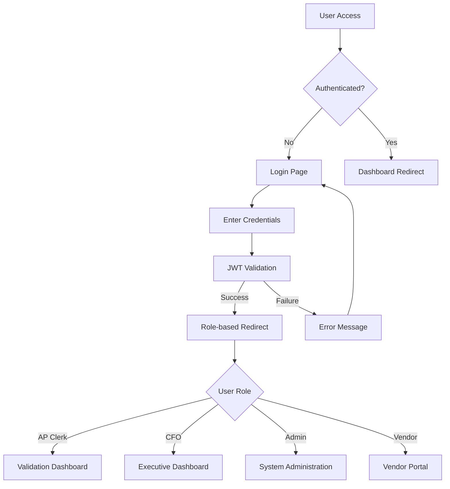
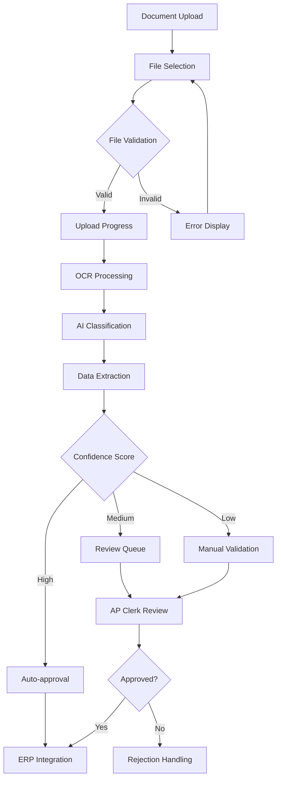
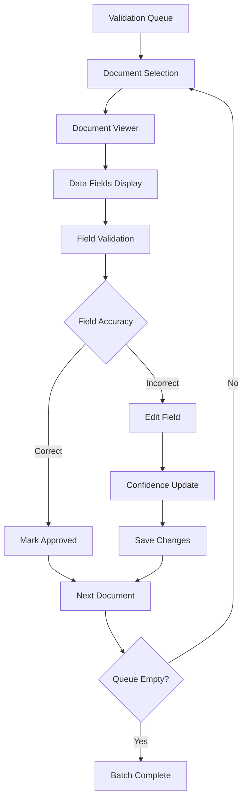
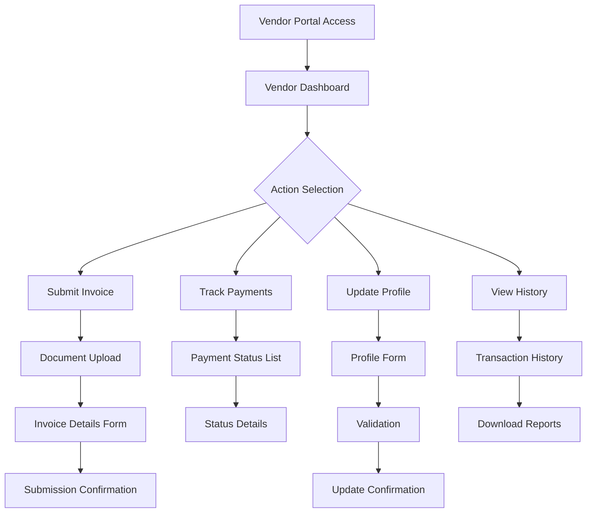
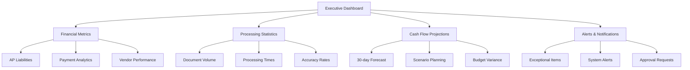
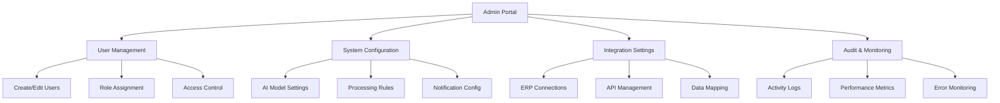

# Apex IDP - User Interface Flow Documentation

## Overview

This document provides comprehensive documentation for the Apex Intelligent Document Processing (IDP) platform's user interface flows. The platform serves multiple user types with distinct workflows for document processing, validation, and financial management.

## Table of Contents

1. [User Personas](#user-personas)
2. [Authentication Flow](#authentication-flow)
3. [Document Upload Flow](#document-upload-flow)
4. [Validation Workflow](#validation-workflow)
5. [Vendor Management](#vendor-management)
6. [Executive Dashboard](#executive-dashboard)
7. [System Administration](#system-administration)
8. [API Integration](#api-integration)
9. [Mobile Responsiveness](#mobile-responsiveness)
10. [Accessibility Guidelines](#accessibility-guidelines)

## User Personas

### 1. AP Clerks
- **Primary Role**: Document validation and exception handling
- **Key Features**: Validation interface, batch processing, real-time notifications
- **Technical Level**: Basic to intermediate

### 2. Hospital CFOs
- **Primary Role**: Financial oversight and strategic planning
- **Key Features**: Executive dashboard, cash flow projections, payment analytics
- **Technical Level**: Business-focused, non-technical

### 3. IT Administrators
- **Primary Role**: System configuration and user management
- **Key Features**: User administration, integration management, audit logs
- **Technical Level**: Advanced technical

### 4. Vendors
- **Primary Role**: Invoice submission and payment tracking
- **Key Features**: Self-service portal, document upload, status tracking
- **Technical Level**: Basic

## Authentication Flow

### Authentication Screens

1. **Login Screen**
   - Username/email input
   - Password input with show/hide toggle
   - "Remember me" checkbox
   - "Forgot password" link
   - Company logo and branding

2. **Role-based Landing Pages**
   - Different dashboard layouts per user type
   - Contextual navigation menus
   - Quick action buttons
   - Recent activity summaries

## Document Upload Flow

### Upload Interface Specifications

1. **Drag & Drop Zone**
   - Visual feedback for hover states
   - Supported format indicators (PDF, PNG, JPG, TIFF)
   - File size limits clearly displayed
   - Multiple file selection support

2. **Progress Indicators**
   - Real-time upload progress bars
   - Processing status updates
   - Estimated completion times
   - Error handling with retry options

3. **Batch Processing**
   - Bulk upload capabilities
   - Batch status monitoring
   - Individual document status within batches
   - Batch-level actions (approve all, reject all)

## Validation Workflow

### Validation Interface Elements

1. **Document Viewer**
   - PDF/image rendering with zoom controls
   - Annotation tools for marking corrections
   - Split-screen layout (document + data fields)
   - Keyboard shortcuts for efficiency

2. **Data Fields Panel**
   - Extracted field values with confidence indicators
   - Color-coded validation status (green=validated, yellow=uncertain, red=error)
   - Dropdown suggestions for common values
   - Field-level comments and notes

3. **Validation Actions**
   - Approve/reject buttons with confirmation
   - Bulk actions for similar field types
   - Exception escalation workflows
   - Audit trail logging

## Vendor Management

### Vendor Portal Features

1. **Invoice Submission**
   - Guided upload process
   - Pre-filled vendor information
   - Invoice validation in real-time
   - Submission receipts and confirmations

2. **Payment Tracking**
   - Visual status indicators
   - Estimated payment dates
   - Email notifications for status changes
   - Payment history with search/filter

3. **Self-Service Features**
   - Profile management
   - Banking information updates
   - Document templates download
   - Support ticket submission

## Executive Dashboard

### Dashboard Components

1. **Key Performance Indicators (KPIs)**
   - Real-time metric cards
   - Trend indicators with historical comparison
   - Drill-down capabilities
   - Export functionality

2. **Interactive Charts**
   - Cash flow projections with scenario modeling
   - Processing volume trends
   - Vendor payment patterns
   - Cost savings analytics

3. **Alert Management**
   - Priority-based notification system
   - Customizable alert thresholds
   - Action buttons for quick resolution
   - Escalation workflows

## System Administration

### Administrative Functions

1. **User & Role Management**
   - User creation and deactivation
   - Role-based access control (RBAC)
   - Permission matrix management
   - Single sign-on (SSO) configuration

2. **System Configuration**
   - AI model parameter tuning
   - Workflow rule configuration
   - Email template management
   - System-wide settings

3. **Integration Management**
   - ERP system connectivity
   - API endpoint configuration
   - Data transformation rules
   - Connection monitoring

## Technical Specifications

### Performance Requirements
- Page load times: <2 seconds
- Document processing: <30 seconds for standard invoices
- Real-time updates: <1 second WebSocket latency
- Concurrent users: 500+ simultaneous sessions

### Browser Compatibility
- Chrome 90+
- Firefox 88+
- Safari 14+
- Edge 90+

### Mobile Responsiveness
- Tablet support: iPad Pro, Android tablets
- Mobile support: iPhone 12+, Android 10+
- Touch-optimized interfaces
- Offline capability for basic functions

### Accessibility Standards
- WCAG 2.1 AA compliance
- Screen reader compatibility
- Keyboard navigation support
- High contrast mode
- Font size adjustments

## Security Considerations

### Data Protection
- End-to-end encryption for document transmission
- Role-based data access controls
- Audit logging for all user actions
- Data retention policies

### Authentication & Authorization
- Multi-factor authentication (MFA)
- Session management and timeouts
- Password complexity requirements
- OAuth 2.0 / OpenID Connect support

## Integration Points

### ERP Systems
- SAP, Oracle, NetSuite connectors
- Real-time data synchronization
- Bidirectional communication
- Error handling and retry logic

### Document Storage
- Cloud storage integration (AWS S3, Azure Blob)
- Document versioning
- Backup and disaster recovery
- Compliance with retention policies

### Notification Systems
- Email notifications
- SMS alerts for critical events
- In-app notifications
- WebSocket real-time updates

## Testing Strategy

### User Acceptance Testing
- Persona-based test scenarios
- End-to-end workflow validation
- Performance testing under load
- Accessibility testing

### Browser Testing
- Cross-browser compatibility
- Mobile device testing
- Progressive web app functionality
- Offline capability validation

## Future Enhancements

### Planned Features
- Machine learning model improvements
- Advanced analytics and reporting
- Mobile app development
- Voice-activated commands

### Scalability Considerations
- Microservices architecture migration
- Container orchestration (Kubernetes)
- Auto-scaling based on demand
- Multi-region deployment

---

## Quick Reference

### Navigation Shortcuts
- `Ctrl+D`: Quick document upload
- `Ctrl+F`: Global search
- `Ctrl+N`: New batch creation
- `Ctrl+S`: Save current work
- `Esc`: Cancel current action

### Support Contacts
- Technical Support: support@apex-idp.com
- User Training: training@apex-idp.com
- System Administration: admin@apex-idp.com

---

*This documentation is maintained by the Apex IDP development team and updated with each release.*
