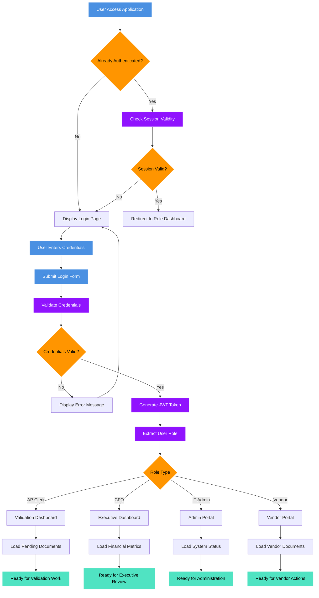
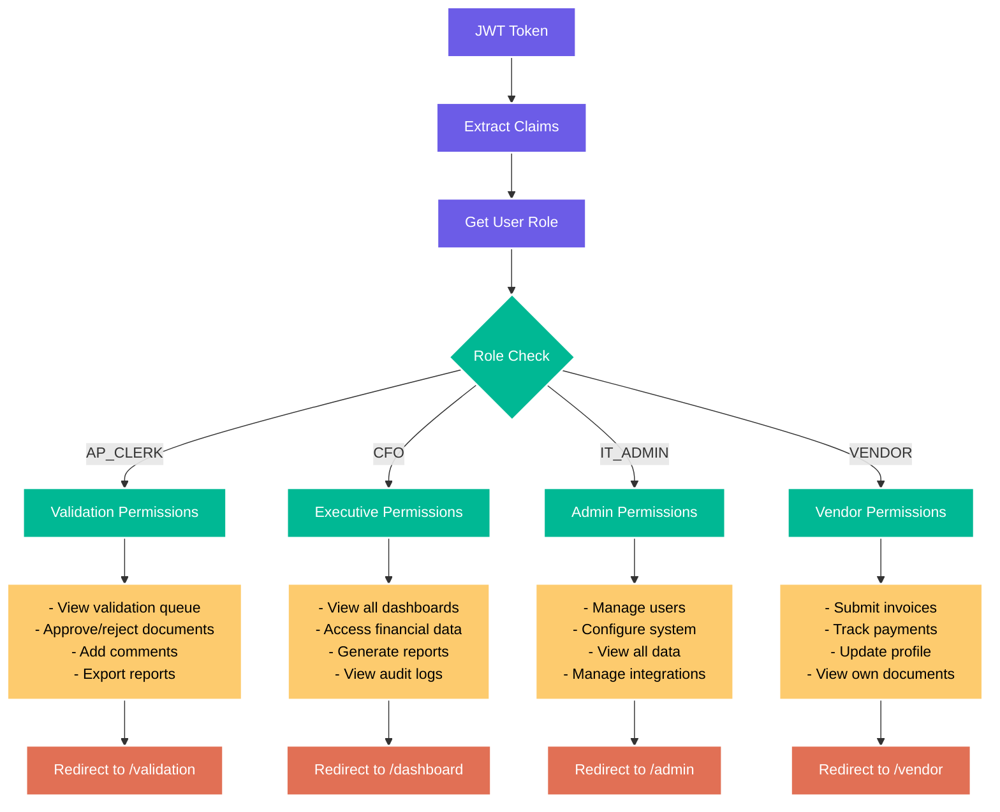
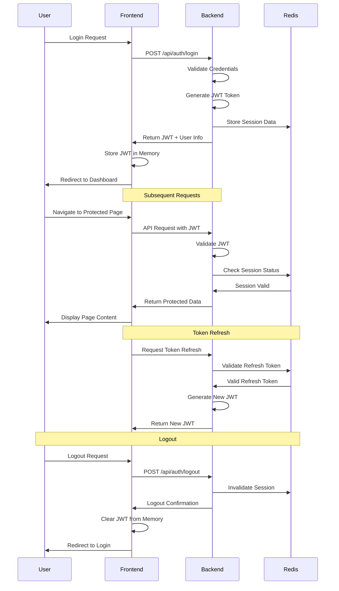
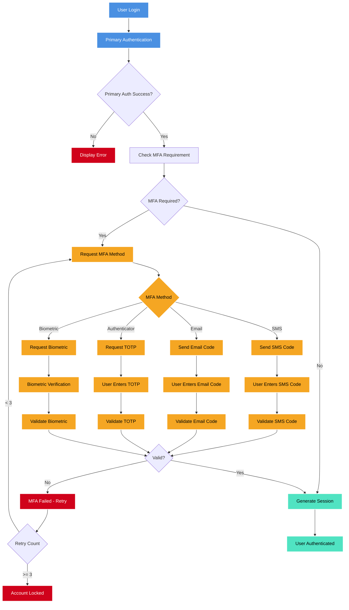
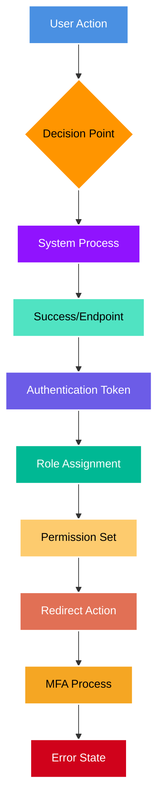

# Authentication Flow Diagram

This diagram shows the complete authentication and authorization flow for all user types in the Apex IDP platform.

## Authentication Flow

## Role-Based Access Control

## Session Management

## Multi-Factor Authentication (Future Enhancement)

## Security Considerations

### Token Security

- JWT tokens are stored in memory only (not localStorage)
- Tokens have short expiration times (15 minutes)
- Refresh tokens are used for session extension
- All tokens are invalidated on logout

### Password Security

- Passwords are hashed using bcrypt with salt
- Password complexity requirements enforced
- Account lockout after failed attempts
- Password reset via secure email tokens

### Session Security

- Sessions are stored in Redis with TTL
- Session data includes IP address validation
- Concurrent session limits per user
- Automatic session cleanup

---

## Dark Mode Color Legend

The following color scheme has been optimized for dark backgrounds with high contrast and accessibility in mind:

### Authentication Flow Color Code Reference:

| Color         | Hex Code  | Purpose                    | Text Color | Usage Context                            |
| ------------- | --------- | -------------------------- | ---------- | ---------------------------------------- |
| 🔵 **Blue**   | `#4A90E2` | User Actions & Input       | White      | Login forms, user interactions           |
| 🟠 **Orange** | `#FF9500` | Decision Points            | Black      | Authentication checks, role routing      |
| 🟣 **Purple** | `#9013FE` | System Processing          | White      | Token generation, validation             |
| 🔷 **Teal**   | `#50E3C2` | Success States & Endpoints | Black      | Successful completion, ready states      |
| 🟣 **Indigo** | `#6C5CE7` | Authentication Tokens      | White      | JWT handling, token operations           |
| 🟢 **Green**  | `#00B894` | Role Assignment            | White      | User role determination                  |
| 🟡 **Yellow** | `#FDCB6E` | Permission Sets            | Black      | Permission definitions, access rights    |
| 🔸 **Coral**  | `#E17055` | Redirect Actions           | White      | Navigation, routing operations           |
| 🟤 **Amber**  | `#F5A623` | MFA Processes              | Black      | Multi-factor authentication steps        |
| 🔴 **Red**    | `#D0021B` | Error States               | White      | Authentication failures, security issues |

### Authentication-Specific Design Principles:

- **Security Focus**: Red for errors emphasizes security concerns
- **Process Flow**: Purple for system processes maintains consistency with other diagrams
- **User Clarity**: Blue for user actions provides clear interaction points
- **Role Distinction**: Separate colors for roles, permissions, and redirects for clarity
- **MFA Emphasis**: Distinct amber color for multi-factor authentication processes
- **High Contrast**: All colors provide excellent visibility on dark backgrounds
- **Accessibility**: Compliant with WCAG 2.1 AA standards for color contrast

_This diagram is part of the Apex IDP UI Flow Documentation_
_Last updated: [Current Date]_
