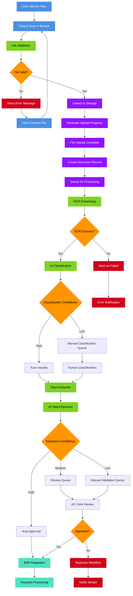
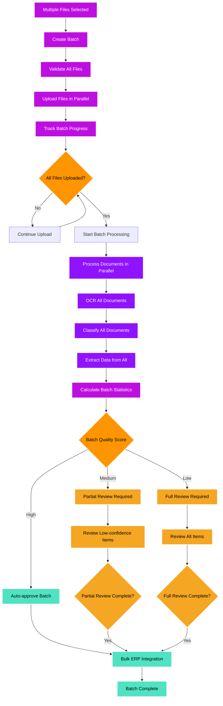
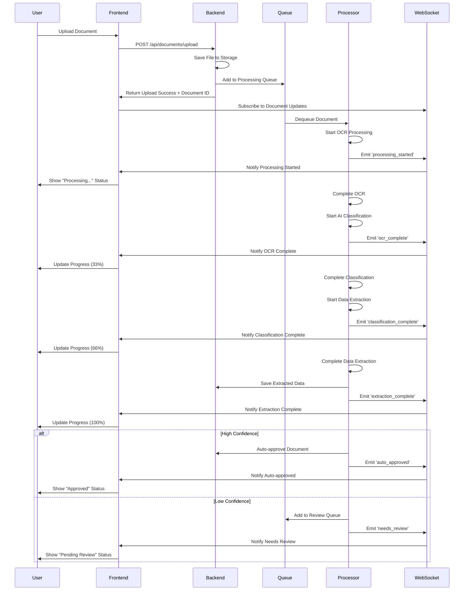
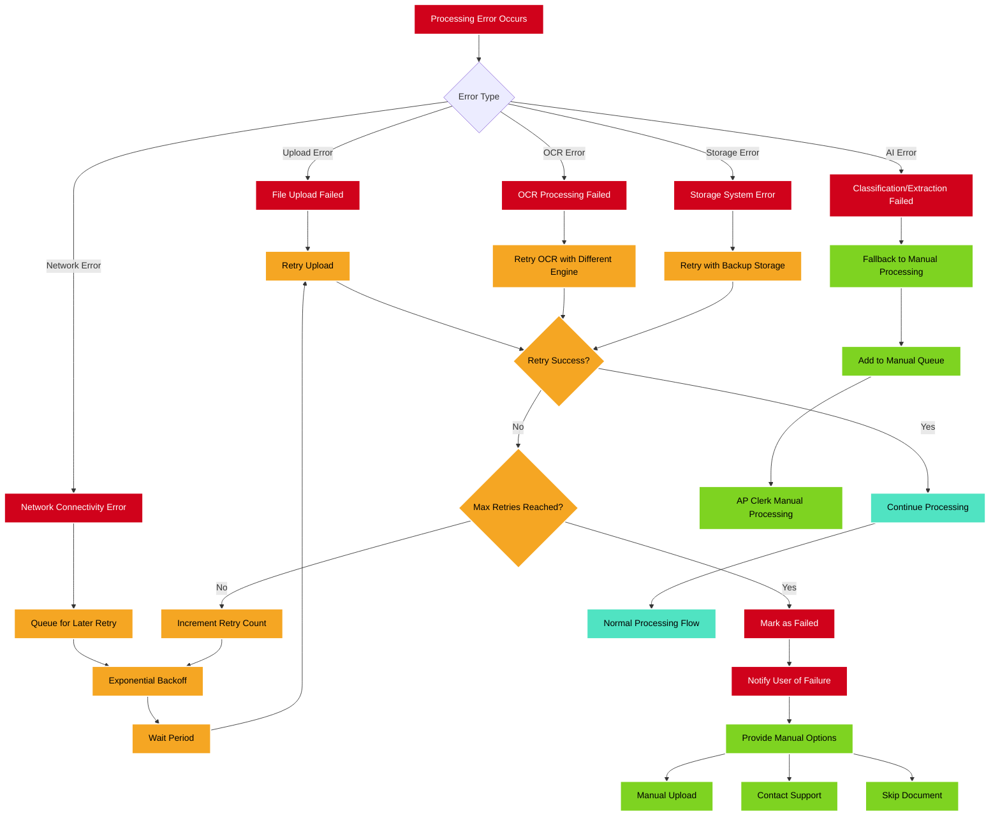
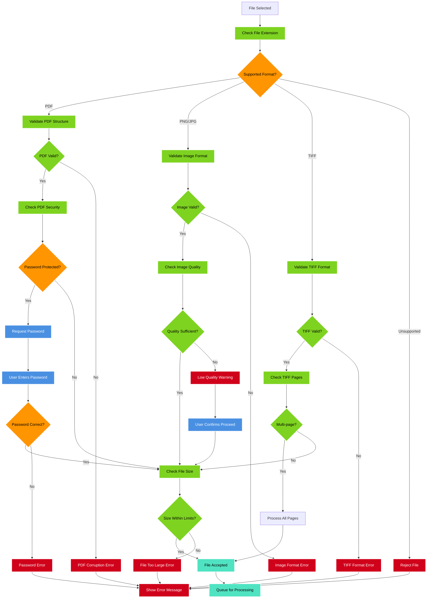
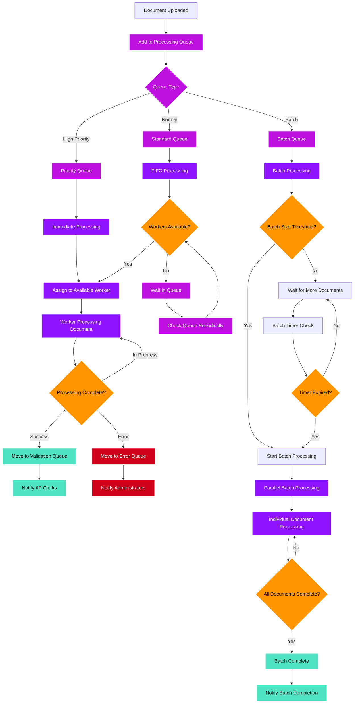
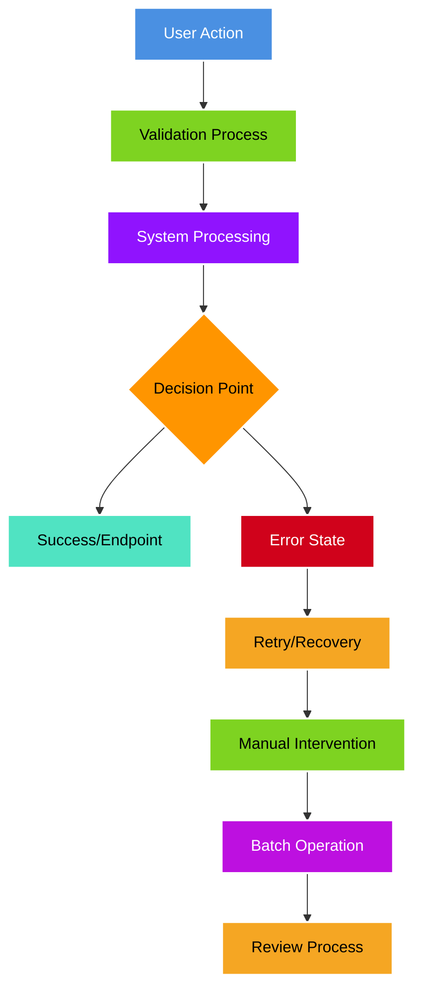

# Document Upload and Processing Flow

This diagram shows the complete document upload, processing, and validation workflow in the Apex IDP platform.

## Document Upload Flow

## Batch Processing Flow

## Real-time Processing Updates

## Error Handling and Recovery

## File Format Support and Validation

## Processing Queue Management

---

## Dark Mode Color Legend

The following color scheme has been optimized for dark backgrounds with high contrast and accessibility in mind:

### Color Code Reference:

| Color          | Hex Code  | Purpose                           | Text Color |
| -------------- | --------- | --------------------------------- | ---------- |
| 🔵 **Blue**    | `#4A90E2` | User Actions & Input              | White      |
| 🟢 **Green**   | `#7ED321` | Validation & Manual Processes     | Black      |
| 🟣 **Purple**  | `#9013FE` | System Processing                 | White      |
| 🟠 **Orange**  | `#FF9500` | Decision Points                   | Black      |
| 🔷 **Teal**    | `#50E3C2` | Success States & Endpoints        | Black      |
| 🔴 **Red**     | `#D0021B` | Error States                      | White      |
| 🟡 **Yellow**  | `#F5A623` | Retry/Recovery & Review Processes | Black      |
| 🟣 **Magenta** | `#BD10E0` | Batch Operations                  | White      |

### Design Principles:

- **High Contrast**: All colors provide sufficient contrast against dark backgrounds
- **Accessibility**: Compliant with WCAG 2.1 AA standards for color contrast
- **Semantic Meaning**: Each color represents a specific type of operation or state
- **Consistency**: Same color types are used across all diagrams for visual coherence
- **Text Legibility**: Text colors (black/white) chosen for optimal readability

_This diagram is part of the Apex IDP UI Flow Documentation_
_Last updated: [Current Date]_
