# Validation Workflow Diagram

This diagram shows the complete validation workflow for AP Clerks processing documents in the Apex IDP platform.

## Validation Queue Management

## Field-by-Field Validation Process

## Document Annotation System

## Batch Validation Workflow

```mermaid
graph TD
    A[Batch Arrives in Queue] --> B[Batch Summary View]
    B --> C[Show Batch Statistics]

    C --> D[Total Documents: X]
    C --> E[High Confidence: Y]
    C --> F[Needs Review: Z]
    C --> G[Processing Errors: W]

    D --> H{Batch Action Choice}
    H -->|Review All| I[Individual Document Review]
    H -->|Approve High Confidence| J[Bulk Approve Workflow]
    H -->|Review Low Confidence Only| K[Filtered Review Workflow]
    H -->|Reject Entire Batch| L[Batch Rejection Workflow]

    I --> M[Document-by-Document Review]
    M --> N[Standard Validation Process]
    N --> O{Document Complete?}
    O -->|Yes| P[Next Document in Batch]
    O -->|No| N
    P --> Q{More Documents?}
    Q -->|Yes| M
    Q -->|No| R[Batch Validation Complete]

    J --> S[Select High Confidence Items]
    S --> T[Bulk Approval Confirmation]
    T --> U[Approve Selected Documents]
    U --> V[Review Remaining Documents]
    V --> W{All Reviewed?}
    W -->|No| V
    W -->|Yes| R

    K --> X[Filter by Confidence <70%]
    X --> Y[Review Only Low Confidence]
    Y --> Z[Individual Validation]
    Z --> AA{Low Confidence Items Done?}
    AA -->|No| Z
    AA -->|Yes| BB[Auto-approve High Confidence]
    BB --> R

    L --> CC[Batch Rejection Reason]
    CC --> DD[Notify Vendor/Submitter]
    DD --> EE[Return Entire Batch]
    EE --> FF[Update Batch Status]

    R --> GG[Calculate Batch Metrics]
    GG --> HH[Approved: A documents]
    GG --> II[Rejected: B documents]
    GG --> JJ[Total Processing Time: T]

    HH --> KK[Send to ERP Integration]
    II --> LL[Generate Rejection Report]
    JJ --> MM[Update Performance Metrics]

    KK --> NN[Batch Processing Complete]
    LL --> NN
    MM --> NN
    FF --> NN

    classDef batch fill:#6C5CE7,stroke:#FFFFFF,stroke-width:2px,color:#FFFFFF
    classDef statistics fill:#FDCB6E,stroke:#FFFFFF,stroke-width:2px,color:#000000
    classDef workflow fill:#9013FE,stroke:#FFFFFF,stroke-width:2px,color:#FFFFFF
    classDef completion fill:#50E3C2,stroke:#FFFFFF,stroke-width:2px,color:#000000
    classDef rejection fill:#D0021B,stroke:#FFFFFF,stroke-width:2px,color:#FFFFFF

    class A,B,C,D,E,F,G batch
    class H,I,J,K,L,S,T,X,Y statistics
    class M,N,V,Z,CC,DD workflow
    class R,GG,KK,NN completion
    class L,CC,DD,EE,FF,LL rejection
```

## Real-time Collaboration Features

---

## Dark Mode Color Legend

The following color scheme has been optimized for dark backgrounds with high contrast and accessibility, specifically designed for validation workflows:

### Validation Workflow Color Code Reference:

| Color              | Hex Code  | Purpose               | Text Color | Validation Context                                  |
| ------------------ | --------- | --------------------- | ---------- | --------------------------------------------------- |
| 🔵 **Blue**        | `#4A90E2` | Clerk Actions         | White      | Login, dashboard navigation, user interactions      |
| 🟠 **Orange**      | `#FF9500` | Decision Points       | Black      | Document availability, field accuracy checks        |
| 🟢 **Light Green** | `#7ED321` | Validation Processes  | Black      | Field validation, data verification, OCR confidence |
| 🟣 **Purple**      | `#9013FE` | Action/Workflow Steps | White      | Approve, reject, escalate, save operations          |
| 🔷 **Teal**        | `#50E3C2` | Success/Endpoints     | Black      | Completed validations, ERP integration              |
| 🟢 **Dark Green**  | `#00B894` | Confidence Assessment | White      | High/medium/low confidence indicators               |
| 🟡 **Yellow**      | `#F5A623` | Review Processes      | Black      | Manual review, supervisor escalation                |
| 🟣 **Magenta**     | `#BD10E0` | Manual Operations     | White      | Manual data entry, corrections, verification        |
| 🟣 **Indigo**      | `#6C5CE7` | Batch Operations      | White      | Batch processing, bulk approvals                    |
| 🔵 **Light Blue**  | `#74B9FF` | Annotation Tools      | White      | Document annotation, highlighting, comments         |
| 🔸 **Coral**       | `#E17055` | Completion Status     | White      | Document complete, export, reporting                |
| 🔴 **Red**         | `#D0021B` | Rejection/Error       | White      | Document rejection, processing errors               |

### Validation-Specific Design Principles:

- **Clerk Focus**: Blue for clerk actions emphasizes user-driven processes
- **Validation Clarity**: Green shades distinguish validation confidence levels
- **Action Distinction**: Purple variants separate different action types
- **Error Emphasis**: Red highlights rejection and error states for immediate attention
- **Review Workflow**: Yellow indicates items requiring human review
- **Batch Processing**: Indigo provides clear identification of batch operations
- **Tool Integration**: Light blue represents annotation and document tools
- **High Contrast**: All colors provide excellent visibility on dark backgrounds
- **Accessibility**: Compliant with WCAG 2.1 AA standards for color contrast
- **Semantic Workflow**: Colors follow the logical flow of validation processes

### Usage Guidelines:

- **Confidence Levels**: Use green variants to show AI confidence assessments
- **Review States**: Yellow indicates manual review requirements
- **Completion Flow**: Coral shows successful completion and export states
- **Error Handling**: Red provides clear indication of rejection workflows
- **Batch Operations**: Indigo distinguishes batch from individual document processing

_This diagram is part of the Apex IDP UI Flow Documentation_
_Last updated: [Current Date]_
