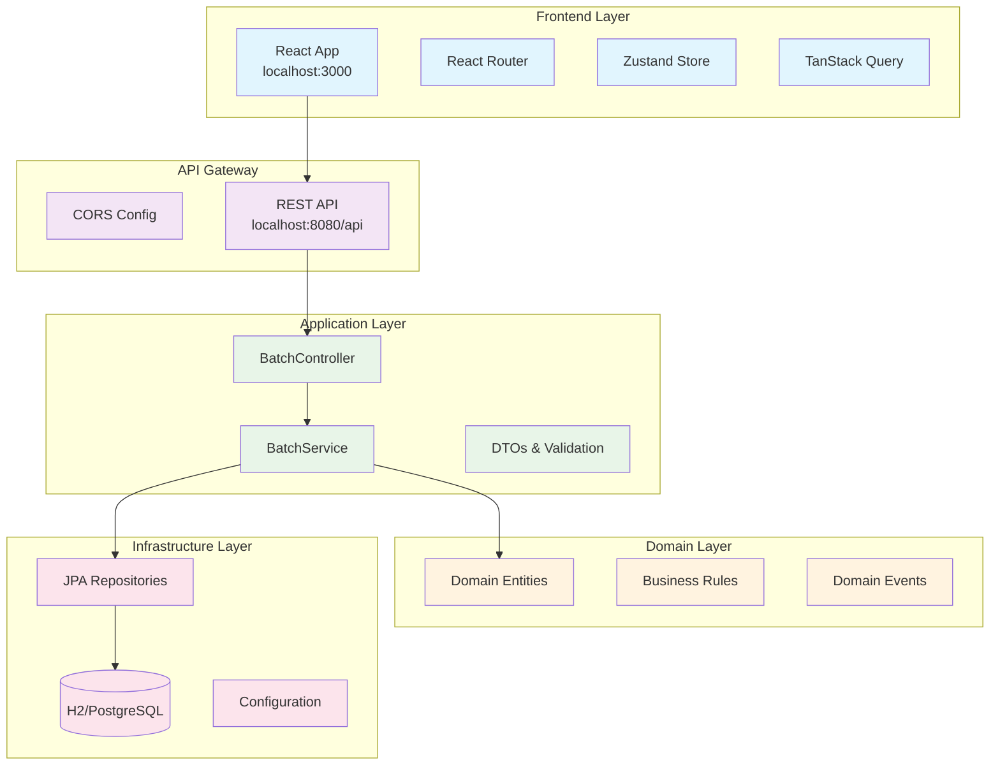

# 🏗️ Apex IDP System - Comprehensive Architecture Blueprint

## 📊 1. Architecture Detection and Analysis

### **Detected Architecture Pattern**: ✅ **Hexagonal (Clean) Architecture**
- **Evidence Found**: Package structure follows ports and adapters pattern
- **Domain Layer**: `com.apex.apexidp.domain.entities` - Core business entities
- **Application Layer**: `com.apex.apexidp.application` - Use cases and DTOs
- **Infrastructure Layer**: `com.apex.apexidp.infrastructure` - Data persistence
- **Interface Layer**: `com.apex.apexidp.interfaces.rest` - External API adapters

### **Technology Stack Detected**:

**Backend (Spring Boot)**:
- ✅ Spring Boot 3.2.4 with Java 17
- ✅ Spring Data JPA with Hibernate 6.4.4
- ✅ H2 Database (development), PostgreSQL (production ready)
- ✅ OpenAPI 3.0 with Swagger UI
- ✅ Spring Security Ready
- ✅ Actuator for monitoring

**Frontend (React)**:
- ✅ React 18.2 with TypeScript
- ✅ Vite for build tooling
- ✅ React Router v6 for navigation
- ✅ Zustand for state management
- ✅ TanStack Query for data fetching
- ✅ Tailwind CSS for styling
- ✅ Comprehensive UI component ecosystem

## 🎯 2. Architectural Overview



## 🏛️ 3. Core Architectural Components

### **3.1 Domain Layer** (`domain/`)
```
📁 entities/
├── Batch.java           - Core batch aggregate
├── Document.java        - Document entity
├── ExtractedData.java   - AI extraction results
├── BatchStatus.java     - Status enumeration
└── DocumentType.java    - Document classification
```

**Key Characteristics**:
- ✅ Rich domain entities with business logic
- ✅ JPA annotations for ORM mapping
- ✅ Entity listeners for auditing
- ✅ UUID-based primary keys
- ✅ Proper entity relationships with foreign keys

### **3.2 Application Layer** (`application/`)
```
📁 services/
└── BatchService.java    - Orchestrates batch operations

📁 dto/
├── BatchDTO.java        - Full batch data transfer
├── BatchSummaryDTO.java - List view optimization
└── CreateBatchRequest.java - Command object
```

**Key Characteristics**:
- ✅ Service-oriented design with `@Service` annotation
- ✅ Transaction management with `@Transactional`
- ✅ DTO pattern for API contracts
- ✅ Validation with Bean Validation (JSR-380)

### **3.3 Interface Layer** (`interfaces/rest/`)
```
📁 rest/
└── BatchController.java - REST API endpoints
```

**Key Characteristics**:
- ✅ RESTful API design principles
- ✅ OpenAPI documentation with Swagger annotations
- ✅ Proper HTTP status codes and ResponseEntity usage
- ✅ Constructor dependency injection

### **3.4 Infrastructure Layer** (`infrastructure/`)
```
📁 repositories/
├── BatchRepository.java    - Batch data access
└── DocumentRepository.java - Document data access
```

**Key Characteristics**:
- ✅ Spring Data JPA repositories
- ✅ Custom query methods with `@Query`
- ✅ Pagination support with `Pageable`
- ✅ Type-safe repository interfaces

## 🔧 4. Architectural Layers and Dependencies

### **Dependency Direction** (Clean Architecture Compliance):
```
Interfaces → Application → Domain ← Infrastructure
```

**✅ Proper Dependencies**:
- Controllers depend on Services (Application Layer)
- Services depend on Domain Entities and Repository Interfaces
- Infrastructure implements Domain Repository Interfaces
- Domain layer has no outward dependencies

### **Configuration Layer** (`config/`)
```
📁 config/
├── OpenApiConfig.java  - API documentation setup
└── CorsConfig.java     - Cross-origin configuration
```

## 📊 5. Data Architecture

### **5.1 Entity Relationship Model**:

```mermaid
erDiagram
    BATCH ||--o{ DOCUMENT : contains
    DOCUMENT ||--|| EXTRACTED_DATA : has
    
    BATCH {
        uuid id PK
        string batch_number UK
        string name
        enum status
        int total_documents
        int processed_documents
        int successful_documents
        int failed_documents
        decimal total_amount
        timestamp created_at
        timestamp updated_at
        timestamp processing_started_at
        timestamp processing_completed_at
    }
    
    DOCUMENT {
        uuid id PK
        uuid batch_id FK
        string filename
        string original_filename
        string file_path
        string mime_type
        bigint file_size
        enum type
        enum status
        decimal confidence_score
        text error_message
        timestamp created_at
        timestamp updated_at
        timestamp processing_started_at
        timestamp processing_completed_at
    }
    
    EXTRACTED_DATA {
        uuid id PK
        uuid document_id FK
        string vendor_name
        string vendor_email
        string vendor_phone
        string vendor_address
        string vendor_tax_id
        string invoice_number
        date invoice_date
        date due_date
        decimal subtotal_amount
        decimal tax_amount
        decimal total_amount
        string currency
        string payment_terms
        string purchase_order_number
        text remit_to_address
        text description
        text line_items
        text raw_ocr_text
        text custom_fields
    }
```


### **5.2 Database Configuration**:
```yaml
# Development (H2)
spring:
  datasource:
    driver-class-name: org.h2.Driver
    url: jdbc:h2:mem:testdb
    
# Production Ready (PostgreSQL)
spring:
  datasource:
    driver-class-name: org.postgresql.Driver
    url: jdbc:postgresql://localhost:5432/apex_idp
```

## 🔄 6. Cross-Cutting Concerns Implementation

### **6.1 Transaction Management**:
```java
@Service
@Transactional                    // Class-level default
public class BatchService {
    
    @Transactional(readOnly = true) // Read-only optimization
    public Page<BatchSummaryDTO> getAllBatches(Pageable pageable)
    
    @Transactional               // Write transaction
    public BatchDTO createBatch(CreateBatchRequest request)
}
```

### **6.2 Validation & Error Handling**:
```java
@PostMapping
public ResponseEntity<BatchDTO> createBatch(
    @Valid @RequestBody CreateBatchRequest request) // Bean Validation
```

### **6.3 API Documentation**:
```java
@Tag(name = "Batch Management", description = "Operations for managing document processing batches")
@Operation(summary = "Create a new batch", description = "Creates a new batch for document processing")
```

### **6.4 CORS Configuration**:
```java
@Configuration
public class CorsConfig {
    @Value("${app.cors.allowed-origins}")
    private String[] allowedOrigins; // Environment-specific configuration
}
```

## 🌐 7. Service Communication Patterns

### **7.1 Frontend-Backend Communication**:
```typescript
// React Frontend Architecture
App.tsx
├── Router (React Router v6)
├── Layout Component
└── AppRoutes
    ├── Dashboard
    ├── Batches 
    └── Documents

// State Management (Zustand)
store/
├── batchStore.ts    - Batch state management
├── documentStore.ts - Document state management
└── uiStore.ts      - UI state management

// API Layer (TanStack Query)
api/
├── batchApi.ts     - Batch API calls
├── documentApi.ts  - Document API calls
└── client.ts       - Axios configuration
```

### **7.2 API Contract Design**:
```typescript
// RESTful API Endpoints
GET    /api/batches              - List batches (paginated)
POST   /api/batches              - Create batch
GET    /api/batches/{id}         - Get batch details
PUT    /api/batches/{id}         - Update batch
DELETE /api/batches/{id}         - Delete batch
POST   /api/batches/{id}/start   - Start processing
POST   /api/batches/{id}/cancel  - Cancel processing
GET    /api/batches/search       - Search batches
```

## 🛠️ 8. Technology-Specific Architectural Patterns

### **8.1 Spring Boot Patterns**:
```java
// Constructor Injection (Recommended)
@RestController
public class BatchController {
    private final BatchService batchService;
    
    public BatchController(BatchService batchService) {
        this.batchService = batchService;
    }
}

// Repository Pattern with Spring Data JPA
@Repository
public interface BatchRepository extends JpaRepository<Batch, UUID> {
    @Query("SELECT b FROM Batch b WHERE b.name LIKE %:name%")
    Page<Batch> findByNameContaining(@Param("name") String name, Pageable pageable);
}

// DTO Mapping Pattern
private BatchDTO mapToBatchDTO(Batch batch) {
    // Manual mapping or use MapStruct for complex scenarios
}
```

### **8.2 React Patterns**:
```typescript
// Component Composition
function App() {
  return (
    <Router>
      <Layout>
        <AppRoutes />
      </Layout>
    </Router>
  )
}

// State Management with Zustand
interface BatchStore {
  batches: Batch[]
  loading: boolean
  fetchBatches: () => Promise<void>
  createBatch: (batch: CreateBatchRequest) => Promise<void>
}

// Data Fetching with TanStack Query
const { data, isLoading, error } = useQuery({
  queryKey: ['batches'],
  queryFn: fetchBatches
})
```

## 🧪 9. Testing Architecture

### **9.1 Backend Testing Strategy**:
```java
// Unit Tests
@ExtendWith(MockitoExtension.class)
class BatchServiceTest {
    @Mock
    private BatchRepository batchRepository;
    
    @InjectMocks
    private BatchService batchService;
}

// Integration Tests
@SpringBootTest
@TestPropertySource(properties = "spring.jpa.hibernate.ddl-auto=create-drop")
class BatchControllerIntegrationTest {
    @Autowired
    private TestRestTemplate restTemplate;
}

// Repository Tests
@DataJpaTest
class BatchRepositoryTest {
    @Autowired
    private TestEntityManager entityManager;
    
    @Autowired
    private BatchRepository batchRepository;
}
```

### **9.2 Frontend Testing Strategy**:
```typescript
// Component Tests (Vitest + React Testing Library)
describe('BatchList Component', () => {
  it('should render batch list correctly', () => {
    render(<BatchList batches={mockBatches} />)
    expect(screen.getByText('Batch List')).toBeInTheDocument()
  })
})

// Integration Tests
describe('Batch API Integration', () => {
  it('should fetch batches successfully', async () => {
    const batches = await fetchBatches()
    expect(batches).toHaveLength(5)
  })
})
```

## 🚀 10. Deployment Architecture

### **10.1 Development Environment**:
```yaml
# Current Setup
Frontend: localhost:3000 (Vite Dev Server)
Backend:  localhost:8080/api (Spring Boot Embedded Tomcat)
Database: H2 In-Memory (Development)
```

### **10.2 Production-Ready Architecture**:
```yaml
# Containerized Deployment
services:
  frontend:
    build: ./apex-app
    ports: ["80:80"]
    
  backend:
    build: ./apex-api  
    ports: ["8080:8080"]
    environment:
      - SPRING_PROFILES_ACTIVE=prod
      
  database:
    image: postgres:16
    environment:
      - POSTGRES_DB=apex_idp
      
  redis:
    image: redis:7-alpine
    
  elasticsearch:
    image: elasticsearch:8.11.0
```

## 📈 11. Extension and Evolution Patterns

### **11.1 Feature Extension Points**:
```java
// Domain Services for Complex Business Logic
@Service
public class DocumentProcessingService {
    // AI/ML integration points
    // Workflow orchestration
    // Event publishing
}

// Event-Driven Architecture Ready
@EventListener
public class BatchEventHandler {
    public void handleBatchCompleted(BatchCompletedEvent event) {
        // Notification service
        // Reporting service
        // Audit logging
    }
}
```

### **11.2 Integration Patterns**:
```java
// External Service Integration
@Component
public class AzureDocumentIntelligenceClient {
    // OCR service integration
}

@Component  
public class ElasticsearchService {
    // Full-text search capabilities
}

@KafkaListener(topics = "document-processing")
public class DocumentProcessingListener {
    // Async document processing
}
```

## 🎯 12. Architecture Governance

### **12.1 Code Quality Standards**:
- ✅ Constructor injection for dependencies
- ✅ Immutable DTOs where possible
- ✅ Proper exception handling with custom exceptions
- ✅ Comprehensive API documentation
- ✅ Transaction boundaries at service layer

### **12.2 Performance Considerations**:
- ✅ Pagination for large datasets
- ✅ Read-only transactions for queries
- ✅ Lazy loading for entity relationships
- ✅ Connection pooling with HikariCP
- ✅ Caching strategy ready (Redis integration points)

### **12.3 Security Patterns**:
```java
// Ready for Spring Security Integration
@Configuration
@EnableWebSecurity
public class SecurityConfig {
    // JWT authentication
    // Role-based authorization
    // CSRF protection for web
}
```

## 🚀 13. Blueprint for New Development

### **13.1 Adding New Features - Step-by-Step**:

**1. Domain First Approach**:
```java
// 1. Create Domain Entity
@Entity
public class NewEntity {
    // Domain logic and relationships
}

// 2. Create Repository Interface
public interface NewEntityRepository extends JpaRepository<NewEntity, UUID> {
    // Custom query methods
}

// 3. Create DTOs
public class NewEntityDTO {
    // API contract
}

// 4. Create Service
@Service
@Transactional
public class NewEntityService {
    // Business logic orchestration
}

// 5. Create Controller
@RestController
@RequestMapping("/new-entities")
public class NewEntityController {
    // REST API endpoints
}
```

**2. Frontend Feature Addition**:
```typescript
// 1. Create Types
interface NewEntity {
  id: string
  name: string
  // properties
}

// 2. Create API Functions
export const fetchNewEntities = async (): Promise<NewEntity[]> => {
  // API integration
}

// 3. Create Store (Zustand)
interface NewEntityStore {
  entities: NewEntity[]
  fetchEntities: () => Promise<void>
}

// 4. Create Components
const NewEntityList: React.FC = () => {
  // Component implementation
}

// 5. Add Routes
const AppRoutes: React.FC = () => {
  return (
    <Routes>
      <Route path="/new-entities" element={<NewEntityList />} />
    </Routes>
  )
}
```

### **13.2 Best Practices for Evolution**:

1. **Follow Existing Patterns**: Use the established Hexagonal Architecture
2. **API First**: Design DTOs and endpoints before implementation
3. **Test-Driven**: Write tests alongside feature development
4. **Configuration Externalization**: Use `application.yml` for all config
5. **Documentation**: Update OpenAPI specs and README files

## 📋 14. Current Implementation Status

### ✅ **Completed & Operational**:
- [x] Hexagonal Architecture foundation
- [x] Core domain entities (Batch, Document, ExtractedData)
- [x] Repository layer with Spring Data JPA
- [x] Service layer with transaction management
- [x] REST API with OpenAPI documentation
- [x] React frontend with modern tooling
- [x] State management with Zustand
- [x] Development environment setup
- [x] CORS configuration for frontend-backend communication
- [x] H2 database with schema generation
- [x] Health monitoring with Actuator

### 🚧 **Ready for Extension**:
- [ ] Document upload and file processing
- [ ] AI/ML integration for OCR and data extraction
- [ ] User authentication and authorization
- [ ] Real-time updates with WebSockets
- [ ] Advanced search with Elasticsearch
- [ ] Caching layer with Redis
- [ ] Event-driven processing with Kafka
- [ ] Production database migration to PostgreSQL
- [ ] Comprehensive test suite
- [ ] Docker containerization for deployment

## 📚 15. Related Documentation

- [Main Project Documentation](./apex-idp.pdf) - Comprehensive IDP system overview
- [API Documentation](http://localhost:8080/api/swagger-ui/index.html) - Interactive API documentation
- [Frontend README](../apex-app/README.md) - React application setup and development
- [Backend README](../apex-api/README.md) - Spring Boot application configuration

## 📝 16. Revision History

| Version | Date | Author | Changes |
|---------|------|--------|---------|
| 1.0 | 2025-08-09 | Architecture Generator | Initial comprehensive architecture blueprint |

---

This architecture blueprint provides a solid foundation for building a comprehensive Intelligent Document Processing system with excellent separation of concerns, testability, and extensibility. The current implementation demonstrates all core architectural patterns and is ready for production enhancement.
